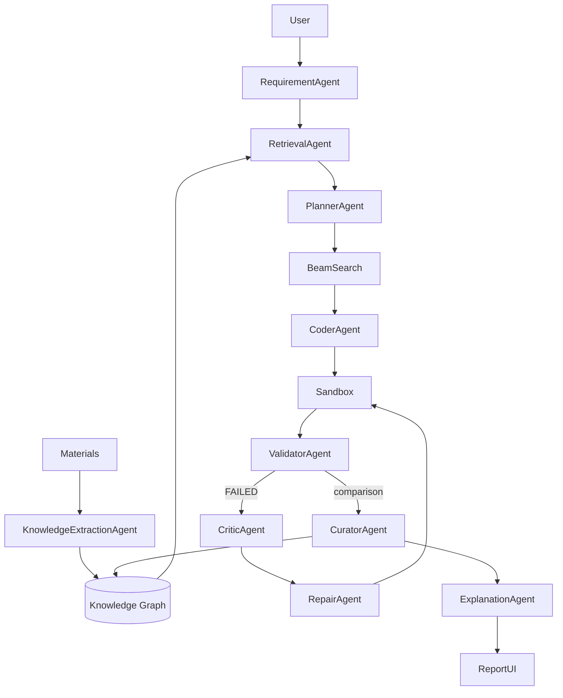

# AI Algorithm Factory / 基于 AI Agent 的算法能力系统

从自然语言需求和业务材料出发，经过 **LLM 结构化理解 → 知识抽取 → GraphRAG → 方案搜索 → LLM 代码生成 → 可信验证 → LLM 自修复 → 经验写回与再检索**，形成可运行、可审计的算法能力原型。

主场景是客户流失预测；同一工作流保留表格回归、异常检测、文本分类插件。项目强调实际执行证据，不能把 Mock、文档声称的历史指标或 GraphML 展示算作真实 LLM 学习。

- [技术审计：改造前真实状态](docs/TECHNICAL_AUDIT.md)
- [系统架构和四张 Mermaid 图](docs/ARCHITECTURE.md)
- [知识图谱 schema、来源与检索](docs/knowledge_graph_schema.md)
- [实际验收结果与限制](docs/FINAL_ACCEPTANCE.md)
- [本次可复查实验产物](examples/acceptance_real_20260907/)

## 1. 背景、目标与技术选择

面向题目中的“能力抽取—复刻—验证—沉淀”闭环。Python/Pydantic 为 Agent 交换提供严格契约；OpenAI-compatible API 方便替换真实 provider；本地 Transformers 可在云端不可用时运行开放权重。scikit-learn 提供透明、可复现的小数据算法。SQLite + NetworkX 保持图查询可解释，避免为小原型引入数据库服务；本地 embeddings/TF-IDF 与图路径融合。FastAPI 同时提供 API、自动 OpenAPI 文档和轻量证据界面。

## 2. 环境安装

推荐 Linux、Python 3.10；不需要 GPU 即可通过 API 运行真实模型或显式执行离线 CI。Windows 不具备 Linux resource/network namespace 的全部限制。

```bash
git clone https://github.com/cucu220123/ai_agent.git
cd ai_agent
python -m venv .venv
source .venv/bin/activate
pip install -r requirements.txt
python -m scripts.generate_demo_data --output data/churn_demo.csv
```

`requirements.txt` 是兼容版本范围；本次实际依赖版本记录在验收环境文件和每个 ValidationRun 的 Environment 中。使用本地模型另安装 `requirements-local.txt`；不需要本地推理时无需安装大型 torch/transformers 依赖。

## 3. 真实 LLM 配置

默认 `LLM_PROVIDER=auto`：优先实际 API，失败时可尝试配置的真实本地模型；没有真实 provider 时抛错。**不静默降级为 Mock**。默认严格模式要求真实需求理解、真实抽取、真实规划和真实生成候选通过验证。

```bash
export LLM_PROVIDER=openai
export AI_FACTORY_SECRET_FILE=/path/outside/repo/secret.txt
# 也支持 OPENAI_BASE_URL / OPENAI_API_KEY / OPENAI_MODEL 环境变量
export AI_FACTORY_TRACE=1
python -m scripts.run_demo
```

配置解析支持 dotenv、JSON、SDK inline keyword 形式；key 从文件/环境读取，环境变量优先。源码、README、日志和 Git 不保存实际凭证。`.env*`、secret*、私钥和 token 文件已忽略；错误和报告统一 sanitize，endpoint 以指纹表示。不要将凭证文件作为知识材料。

支持 JSON schema transport 的服务优先使用它；不支持时明确记录 `json_object` negotiation，再用 Pydantic 与 semantic checks 校验。后者是应用侧严格验收，**不是服务端受约束解码**。语法/语义失败有界重试，不截断 JSON 伪装成功。

本次服务器配置的云端 API 返回额度错误，见验收中的 cloud_probe.json；实际演示使用服务器本地 Qwen2.5-14B-Instruct 的真实 API。这与 Mock 测试明确区分。

### 可选本地 API

```bash
CUDA_VISIBLE_DEVICES=0 LOCAL_LLM_DEVICE=cuda:0 \
  python scripts/serve_local_llm.py --model /path/to/Qwen2.5-14B-Instruct --port 18086
# 另一个终端；local-only 是本地无鉴权服务的占位值，不是云端密钥
export OPENAI_BASE_URL=http://127.0.0.1:18086/v1
export OPENAI_API_KEY=local-only
export OPENAI_MODEL=Qwen2.5-14B-Instruct
export LLM_PROVIDER=openai
python -m scripts.run_demo
```

可选按职责路由：设置 `OPENAI_CODER_MODEL` 与 `OPENAI_CODER_BASE_URL`，Coder/Repair 使用该 API，其余 Agent 使用主 API；`OPENAI_CODER_API_KEY` 可单独设置，否则继承主服务凭证。每次调用记录实际模型；验收采用的模型和量化方式以 FINAL_ACCEPTANCE 为准。

例如另启一个代码模型服务（选择有足够空闲显存的 GPU）：

```bash
CUDA_VISIBLE_DEVICES=1 LOCAL_LLM_DEVICE=cuda:0 LOCAL_LLM_LOAD_IN_4BIT=1 \
  python scripts/serve_local_llm.py --model /path/to/Qwen3-Coder-30B-A3B-Instruct --port 18087
export OPENAI_CODER_BASE_URL=http://127.0.0.1:18087/v1
export OPENAI_CODER_MODEL=Qwen3-Coder-30B-A3B-Instruct
```

NF4 是可选的真实权重量化推理，需要 CUDA 与 bitsandbytes；不是 Mock。服务 `/health` 报告实际模型和量化状态。

有独立 GPU 推理环境时，可使用实测的 vLLM 后端。建议单独安装 `requirements-serving.txt`，避免改动应用的依赖环境；以下显存比例和 GPU 编号应按机器空闲资源调整：

```bash
CUDA_VISIBLE_DEVICES=1,2 python -m vllm.entrypoints.openai.api_server \
  --model /path/to/Qwen3-Coder-30B-A3B-Instruct \
  --served-model-name Qwen3-Coder-30B-A3B-Instruct \
  --tensor-parallel-size 2 --dtype bfloat16 --max-model-len 16384 \
  --gpu-memory-utilization 0.46 --max-num-seqs 2 \
  --max-num-batched-tokens 2048 --enforce-eager \
  --host 127.0.0.1 --port 18088 --no-enable-log-requests
export OPENAI_CODER_BASE_URL=http://127.0.0.1:18088/v1
```

两种服务都保留 OpenAI-compatible 接口；应用不依赖 vLLM 才能运行。验收保留了 NF4 慢速推理、超时与切换到 vLLM 后继续修复的真实记录。

服务仅绑定 loopback、串行推理，不应直接暴露公网。本地权重必须预先存在；加载关闭 trust_remote_code，不自动下载模型。

## 4. Agent 与架构



实现是有职责、prompt、schema、工具权限与错误处理的同步 specialist workflow，不是独立自治的分布式代理。Requirement/Extraction/Planner/Coder/Critic/Repair/Explanation 真正调用模型；检索、验证、写回执行确定性工具。协调器拒绝角色越权工具调用，事件含序号、时间、角色、状态。

## 5. 结构化需求与知识抽取

RequirementAgent 从 LLM JSON 得到 domain/task/target/input/output/dataset/metrics/thresholds/constraints/latency/interpretability/resources/probability/imbalance/hints/uncertainty。CSV 只提供可靠字段与统计，成功理解后不再用 churn 关键词覆盖模型判断。规则解析作为显式离线或失败 fallback。

业务输出字段名与执行协议分开：原始 schema 保存在 trace，执行时映射到注册的 `prediction` / `probability` 等列；输入 schema 排除目标列。类别比例取实测画像，LLM 提议的采样策略不会伪装为已经观测到的数据事实。

正常 workflow 首次抽取 `data/business_material.md`、`data/text_material.md`、`data/reference_preprocessing.py`；内容 hash 命中后复用已有真实抽取。也支持：

```bash
python -m app.cli ingest data/business_material.md --provider openai
python -m app.cli ingest path/to/experiment.json --provider openai
```

Markdown/TXT → LLM 能力/任务/算法/指标/约束；Python → AST imports/signatures/classes/functions + LLM 语义；JSON report → LLM 实验/config/metric/failure。每条实体和关系保留文件、原文跨度、chunk、hash 和可定位偏移；语义关系不能引用不存在的实体。局部抽取失败标为 partial，不当作完整成功。

## 6. KG 与 Hybrid GraphRAG

图实体包含 Capability、Task、Algorithm、Dataset、Feature、PreprocessingStrategy、Metric、Constraint、Dependency、Environment、Config、ValidationRun、FailureExperience、RepairExperience、SourceDocument、AlgorithmVersion。数值留在 run 属性，不为每个分数新建节点。

真实路径：

`structured query → entity linking → relation-aware 1–3 hop search → relevant subgraph → SubgraphSerializer → bounded Planner JSON`

节点链接受 task/domain/type 约束；关系有权重、方向和 hop 衰减；避免通过 Metric/Dependency hub 跨任务泛化。报告保留 anchors、nodes、edges、paths 和精确序列化上下文。

来源检索可以用本地 Transformer 编码器（mean pooling + cosine）；没有模型时明确使用 TF-IDF。融合包含文档分数、graph distance、task compatibility、recency、validation quality。TF-IDF 是词项相似度，不称为神经语义检索。设置 `EMBEDDING_MODEL_PATH` 选择本地模型，`ENABLE_LOCAL_EMBEDDING=0` 禁用。

## 7. 经验学习与探索

每个候选、每个修复轮次写入实际 ValidationRun，而不只写 winner。记录实测数据 profile、样本数、类别比例、配置、预处理、指标、RSS/CPU/runtime、状态、错误、环境、时间、源代码 hash。

下一次任务按 task/data/feature/size/balance/resource similarity 检索，按 recency 加权计算 historical performance、success rate、stability 和成本。文档抽取声称的实验与本验证器实测分层，不能污染 measured prior。

历史先验按有效样本量收缩，并加入 `1/sqrt(1+n)` 探索项；搜索保留算法多样性。LLM 读取真实历史 run 与失败/修复经验，输出设计依据和受限参数建议。**历史是 prior，winner 由当前任务的真实验证决定。** 测试包含历史线性模型高分、当前非线性数据由树模型胜出的反例。

## 8. Candidate Search

状态是 Algorithm + Preprocessing + HyperparameterConfig。表格分类基础空间超过 12 个状态，再合并 LLM 提议；默认 beam=3，日志保留所有扩展、得分与剪枝原因，实际执行保留的候选。单算法任务也可执行多个配置。

这是有限候选空间的一轮组合 beam pruning，具有多样性约束；不是 MCTS、无限程序搜索或全局最优证明。搜索系数目前是可解释启发式。

## 9. 代码生成、修复与版本

正常路径由 LLM 根据真实 requirement/plan/retrieval/API contract 生成完整代码。模板只供 Mock CI 或用户显式允许的 fallback。接口：

```python
train(train_df, target_col, config=None)
predict(model, test_df)             # DataFrame，features only
predict_proba(model, test_df)       # 需要概率时必须提供
evaluate(model, test_df, target_col)
metadata()                        # 设计依据、算法、依赖等
```

失败后 Critic 输出结构化根因、触发条件、可复用教训；Repair 收到原代码、traceback、真实报告、阈值差距、资源和检索经验，输出 diagnosis/strategy/revised_code。同一静态 gate 校验新代码，再实际执行。默认最多 3 轮，不接受 no-op 为修复成功。

每个版本保存为 `generated/run/candidate/versions/vN.py`，包含 code SHA256 和 parent_version。v1 FAILED 不会被 v2 PASS 覆盖；Failure/RepairExperience 会重新进入后续检索。

## 10. 统一验证与沙箱

可信父进程从子进程返回的预测重新计算指标，生成代码的 evaluate 自报结果必须一致。检查包括：

- AST/import/protocol；输出列、行数、类型、NaN/Inf、概率范围与概率接口一致性。
- 标签列排除的静态检查，以及数据中完全复制 target 的泄漏检查。
- 主/次指标与阈值；可选交叉验证；同种子重复与跨种子方差阈值。
- missing values、unseen categories、单行、小批、空输入/无效输入行为。
- 超时、进程组终止、RSS、CPU、预测每行延迟；CPU/address-space/file-size limits。
- 临时工作目录、清空 key/proxy/HOME 等环境、Python audit 网络/文件访问检查；Linux 支持时附加 unshare network namespace。

这是 prototype sandbox。AST/audit 不能证明任意 Python/原生扩展安全；RLIMIT_AS 是虚拟地址空间而非容器内存配额。对不可信用户或生产执行，应改为隔离容器/VM、低权限账号、只读挂载、cgroups、seccomp 与禁网。当前未实现生产 Docker sandbox。

训练/修复可能反复观察同一 holdout，存在验证集过拟合风险；不能把 synthetic demo 指标视为生产效果。无标签异常检测只报告可观测输出统计，不伪造准确率或质量分数。

## 11. CLI / API / Web

```bash
python -m app.cli run --description "预测客户流失，ROC-AUC 不低于 0.8，输出概率" \
  --data data/churn_demo.csv --provider openai --beam-width 3 --max-repairs 3
python -m app.cli run --description "表格回归预测" --data data/regression_demo.csv --cv-folds 3
python -m app.cli knowledge
python -m app.cli plugins
uvicorn app.api:app --host 127.0.0.1 --port 8000
```

打开 `/ui` 查看结构化需求、相关子图、图路径、候选排名、源码、验证、修复链、winner 和知识写回；可按 ValidationRun/FailureExperience/RepairExperience 筛选。查看本轮写回子图使用 `/graph/subgraph?focus=run_id`。接口文档为 `/docs`；主要 API 为 POST /run、POST /knowledge/ingest、GET /reports、/run/{id}、/run/{id}/code、/graph/summary。

API 限制数据/材料路径在 workspace 内，报告代码只能从已登记 generated artifact 读取。没有公开服务鉴权；默认仅本机运行，长任务使用同步接口。设置 `AI_FACTORY_WORKSPACE` 可隔离数据库、数据、产物与报告。

## 12. 可复现实验

正常主 demo 默认真实路径：`python -m scripts.run_demo`。严格验收（只能选真实 provider）：

```bash
python scripts/probe_llm.py --secret-file /path/to/config --output examples/my_acceptance/cloud_probe.json
python scripts/run_acceptance.py --provider openai --output examples/my_acceptance
```

脚本依次执行 fresh KG 主任务 A、新数据任务 B、真实 LLM 修复案例、文本分类；每阶段有断言，失败非零退出。完成阶段可续跑，重新实验使用新 output 目录。保存 before/after graph、实际 Planner 输入、所有版本、日志、报告、提取知识和 hash manifest。单阶段可用 `--stage first|second|repair|cross|verify`；second/repair 依赖 first。

闭环与修复入口为 `scripts/closed_loop_learning_demo.py`、`scripts/self_repair_demo.py`。旧 benchmarks 和历史 evidence 是当时实验，不能代表当前版本验收；不要用 annotate_evidence 重新标记旧运行。

## 13. 测试与离线路径

```bash
LLM_PROVIDER=mock ENABLE_LOCAL_EMBEDDING=0 pytest -q
LLM_PROVIDER=mock ENABLE_LOCAL_EMBEDDING=0 python -m scripts.run_demo
```

Mock 只验证软件路径和测试 fixture，不是模型能力证据。自动测试隔离 workspace，包含 schema recovery、source grounding、真实图路径、历史再检索、权限分派、插件执行、自修复、多任务、恶意代码阻断、timeout、指标造假、泄漏、资源/CV、稳定性和 actual Task A→B。最新完整统计以 FINAL_ACCEPTANCE 为准。

## 14. 插件扩展

`AlgorithmPlugin` 注册任务类型、参数、search_space、预处理、资源画像，以及可选 renderer；LLM 路径可生成注册算法，确定性 fallback 必须有正确 renderer，未知插件不再偷偷变成 GradientBoosting。可信父进程自定义指标通过 MetricRegistry 的 evaluator 注册。测试实际执行自定义 renderer 与 specificity 指标。

新任务类型还需要可信 split/metric/output protocol 与 worker 支持，不能只注册一个名字就宣称跨任意领域。已有四类任务全部保留回归覆盖。

## 15. 代码结构

```text
app/agents/        结构化需求、抽取、规划、生成、诊断、修复、解释、写回
app/llm/           provider、配置安全、schema negotiation、计量
app/knowledge/     AST/文档抽取、缓存 bootstrap、SQLite/NetworkX
app/retrieval/     图遍历、序列化、文档检索、融合
app/experience/    上下文相似度、prior、失败经验
app/search/        状态扩展、评分、多样性 beam
app/execution/     候选执行与不可变修复版本
app/validation/    静态 gate、隔离 worker、可信指标、统一报告
app/plugins/       可执行算法注册
app/metrics/       指标方向、阈值、扩展 evaluator
app/api.py / cli.py / ui/   访问与证据界面
scripts/           数据、实际验收、本地 API 与历史实验
tests/             确定性软件回归
```

## 16. 挑战、限制与扩展

真实调用会遇到 provider 额度、JSON 格式/语义不一致、生成接口错误和资源问题；系统保留失败而不伪装成功，并在同一 gate 下重试。精确来源验证与有限上下文使知识可以追踪，但实体归一化/文本解释仍可能有语义错误。可检查的数值与引用校验不能证明自由文本完全无幻觉。

当前是合成小数据、有限 sklearn 插件、同步单用户图存储、启发式 reranking 和有限 beam。未实现 MCTS、分布式自治 agent、全量仓库跨文件语义分析、生产隔离、自动部署或任意多模态任务。

已注册的指标、概率、延迟和资源约束会执行检查；任意自由文本业务约束仍需补充专用验证插件。可解释性目前参与规划先验，尚不是独立的解释质量评估器。

后续优先级：独立最终测试集和统计置信区间、经验权重学习与消融实验、并发事务与作业队列、生产 sandbox、跨仓库版本/来源追踪、大规模图索引与实体链接评测。


