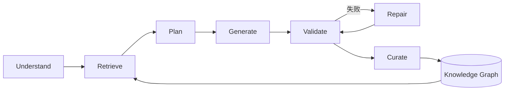
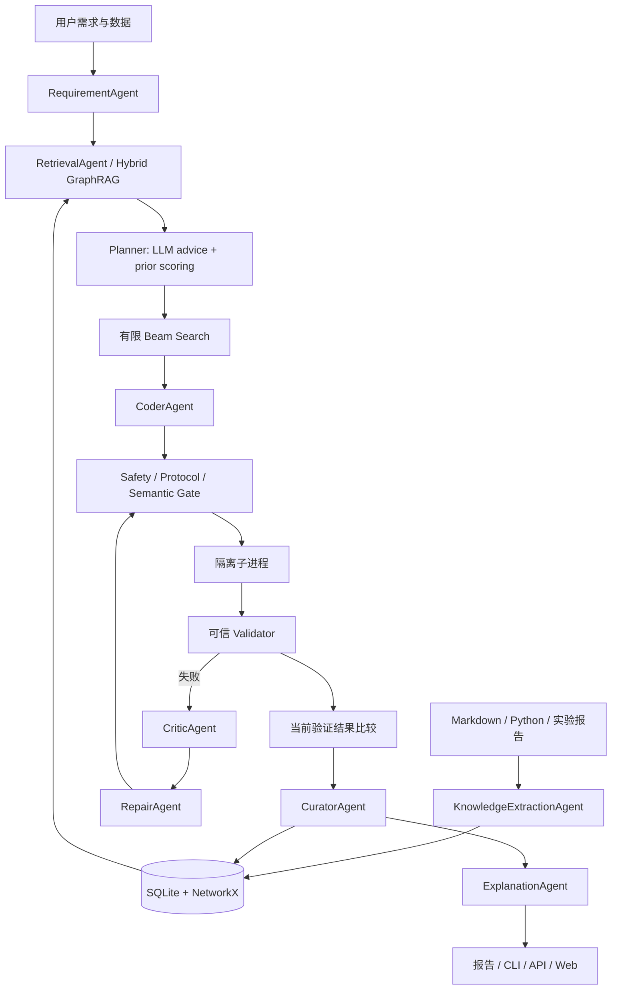
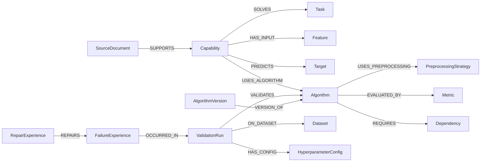
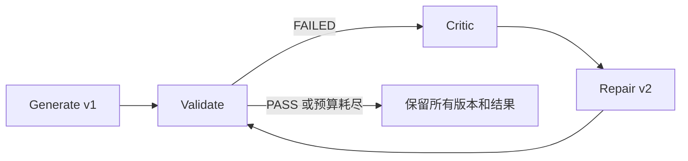
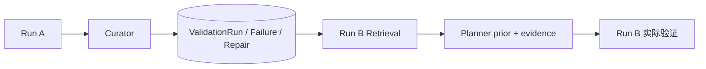
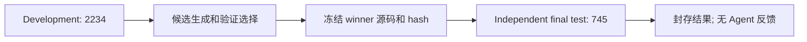

# AI Algorithm Factory

**基于 AI Agent 的算法能力工厂**

从自然语言算法需求和历史知识出发，经能力理解、知识抽取、GraphRAG、方案规划、代码生成、自动验证、代码修复和经验沉淀形成闭环的 Multi-Agent 原型。主场景为**合成客户流失预测**，跨场景验收为**公开文本情感分类**。

| 已保存的实际证据 | 结果与边界 |
|---|---|
| 真实本地 LLM | Qwen2.5-14B-Instruct：理解/抽取/规划/诊断/解释；Qwen3-Coder-30B-A3B-Instruct：生成/修复 |
| 图与经验进入执行 | GraphRAG 子图进入 Planner；真实运行 A 写回后被任务 B 检索 |
| 搜索与验证 | 有限 Beam、多候选实跑、可信指标重算、版本化修复、CLI/API/Web |
| 封存结果 | 客户流失 ROC-AUC **0.9289**、F1 **0.3934**；公开文本独立最终测试 Accuracy **0.8242**、Weighted F1 **0.8241** |

目录：[1 背景](#1-项目背景和目标) · [2 架构](#2-系统架构和模块设计) · [3 图谱](#3-能力知识图谱-schema-和示例) · [4 工作流](#4-agent-工作流设计) · [5 运行](#5-环境配置和运行方法) · [6 数据与实验](#6-示例数据和测试任务说明) · [7 代码示例](#7-生成算法代码示例) · [8 结果与评分证据](#8-验证结果和报告样例) · [9 挑战](#9-遇到的挑战和解决方案) · [10 扩展](#10-后续可扩展方向)。

## 1. 项目背景和目标

### 1.1 背景

算法开发通常需要人工理解需求、选择算法、编写代码和测试；预处理方法、调参经验、失败案例和业务约束则散落在文档、代码与实验记录中。单次代码生成难以同时保证接口正确、指标可信和经验可复用。

本项目将这些材料转为带来源的结构化知识，使自然语言需求经过可追踪的规划、执行和反馈，最终得到可运行代码、验证报告和可供后续任务检索的经验。

### 1.2 项目目标

使用已有 **LLM + Agent workflow + Knowledge Graph + Validator** 实现小型算法能力工厂，不训练新的基础模型。目标包括当前任务的代码修复闭环，以及跨任务的外部经验复用。每项功能都以执行路径和保存的 evidence 为依据。

### 1.3 核心闭环



### 1.4 原题核心要求完成情况

| 原题核心要求 | 状态 | 实现与证据 |
|---|---|---|
| LLM 能力理解、抽取、生成或修复 | ✅ | [Agent 实现](app/agents/)、[真实调用与修复](docs/FINAL_ACCEPTANCE.md) |
| 具体行业场景 | ✅ | 客户流失与评论分类；[数据和任务](#6-示例数据和测试任务说明) |
| 能力知识库/知识图谱 | ✅ | SQLite、NetworkX、GraphML、GraphRAG；[Schema](docs/knowledge_graph_schema.md) |
| 自然语言到可运行代码 | ✅ | [Workflow](app/workflow.py) 串联理解、Planner、Coder 和 Validator |
| 统一验证机制 | ✅ | [ValidationRunner](app/validation/runner.py) 检查功能、指标、稳定性、接口等 |
| 简洁用户接口 | ✅ | [CLI](app/cli.py)、[FastAPI](app/api.py)、[Web](app/ui/) |

## 2. 系统架构和模块设计

### 2.1 总体架构



完整图集见 [ARCHITECTURE.md](docs/ARCHITECTURE.md)。知识抽取是入库阶段，可按源文件内容 hash 复用；每次任务不必重复抽取同一材料。

### 2.2 分层职责与主要代码目录

```text
app/
├── agents/       需求、抽取、建议、规划、生成、诊断、修复、解释、写回
├── knowledge/    AST/文档抽取、bootstrap、SQLite 与 NetworkX 同步
├── retrieval/    实体链接、图遍历、子图序列化、文档向量/词项融合
├── experience/   数据画像相似度、历史 prior、失败经验检索
├── search/       算法×预处理×参数的有限状态扩展与剪枝
├── generation/   任务契约、CodeIR 编译、显式模板路径
├── execution/    候选执行、修复循环与不可变源码版本
├── validation/   静态检查、沙箱 worker、可信指标与报告
├── plugins/      算法/任务插件注册
├── metrics/      指标方向、阈值与自定义 evaluator
├── llm/          provider 路由、JSON transport、重试、脱敏与计量
├── ui/           报告、相关子图、源码与修复链界面
├── api.py        FastAPI 和自动 OpenAPI 文档
├── cli.py        命令行入口
└── workflow.py   调度已有职责组件
experiments/ablation/  独立协议、实验适配器、原始结果与汇总
tests/                 软件单元/集成测试
```

Agent Layer 处理职责与结构化消息；Knowledge Layer 保存可查询知识；Search/Planning Layer 生成可执行候选；Code Generation Layer 产出源码；Execution/Validation Layer 决定是否通过；Experience Layer 保存每次尝试；Interface Layer 提供提交和检查入口。消融目录组装同一套工作流，正常应用不导入实验开关。

### 2.3 技术选择及理由

| 技术 | 选择理由 |
|---|---|
| Python / Pydantic | 适合数据处理；严格交换契约可发现 JSON 类型、字段和语义不一致 |
| SQLite | 无需数据库服务，可随实验隔离与复制；保留完整结构化 payload |
| NetworkX / GraphML | 可解释的关系遍历与子图操作；GraphML 用于快照/展示，不承担 LLM 上下文输入 |
| 本地 embeddings / TF-IDF | 本地 text2vec 进行语义相似度；缺少权重时显式使用词项检索，不虚称神经语义 |
| scikit-learn | 小型分类/回归任务实现透明、训练成本可控、指标可在可信端重算 |
| OpenAI-compatible API / Qwen | 模型服务与应用解耦；指令模型和代码模型按职责路由，调用可计量 |
| FastAPI | 同时提供 API、OpenAPI 文档和轻量 Web 证据界面 |

### 2.4 实现边界

这是同步、单用户的 specialist Multi-Agent prototype，角色有输入输出、prompt、工具权限和失败处理；没有分布式自治代理群或生产任务队列。沙箱是 prototype，不保证任意恶意 Python/原生扩展的生产级隔离。配置集中在 [config.py](app/config.py)，扩展点见 [插件注册](app/plugins/registry.py) 和 [指标注册](app/metrics/registry.py)。

## 3. 能力知识图谱 Schema 和示例

### 3.1 为什么需要图谱

普通文档检索主要返回相似文本。本项目还需要回答“哪个算法解决何种任务、在哪种数据与配置上验证过、为何失败、什么修复有效”。`Task → Algorithm → ValidationRun → Dataset / Failure / Repair` 的关系使历史记录与适用条件可以一起检索，而不是只匹配算法名称。

### 3.2 Entity Schema

| 实体 | 含义 |
|---|---|
| Capability / Task / Algorithm | 可复用能力、待解决任务、算法方法 |
| Dataset / Feature / Target | 数据画像、输入字段、预测目标；输入与标签分开 |
| PreprocessingStrategy / HyperparameterConfig | 预处理策略和一次具体配置 |
| Metric / Constraint | 指标定义、方向与约束；不是某次分数 |
| Dependency / Environment | 包依赖与实际运行环境 |
| ValidationRun | 某次任务、数据、代码版本的实测结果 |
| FailureExperience / RepairExperience | 根因、触发条件、修复动作、是否成功与可复用教训 |
| SourceDocument | 文件、原文跨度、chunk、hash 与来源定位 |
| AlgorithmVersion | 源码 hash、父版本、验证时间与版本归属 |

### 3.3 Relation Schema



关系类型、方向、补充环境/版本关系和设计理由见 [knowledge_graph_schema.md](docs/knowledge_graph_schema.md)；[Schema 校验](app/knowledge/schema.py) 与 [关系测试](tests/test_relation_schema.py) 约束实体类型。图中的 `ON_DATASET` 从 ValidationRun 指向 Dataset。

### 3.4 真实实体与测量示例

正式 [extracted_knowledge.json](examples/acceptance_real_20260907/extracted_knowledge.json) 中：**`age → Feature`、`churn → Target`、`ROC-AUC → Metric`**。例如客户流失 Capability 使用 Logistic Regression，具体 ValidationRun 再关联算法与客户数据集。

`ROC-AUC=0.9288770969` 属于运行 `6bde3f2c39b8` 的实测属性，同时绑定数据、配置、版本和时间；它不是 Logistic Regression 的永久属性，更不代表换数据也能得到相同分数。runtime、memory、timestamp、success 同样保存在运行属性中。

### 3.5 知识来源与 provenance

| 来源 | 抽取过程 | 可追踪内容 |
|---|---|---|
| Markdown / TXT | LLM 抽取能力、任务、算法、指标、约束和专家经验 | 文件、原文跨度、chunk、偏移和 hash |
| Python source | AST 可靠提取 imports/functions/classes/signatures，再由 LLM 理解算法语义 | 静态结构与语义断言各自保留来源 |
| 实验 JSON / Validation report | LLM 提取任务、配置、指标、资源、失败与策略 | 来源实验及其段落；不自动当作可信实测 prior |
| 当前 Validator 结果 | Curator 写回全部候选与修复版本 | measured_workflow、代码 hash、环境与实际指标 |

入口为 [KnowledgeBootstrapper](app/knowledge/bootstrap.py) 与 [抽取组件](app/knowledge/)；跨度与实体引用经过校验。单文件 AST+LLM 已实现，大型仓库跨文件语义分析尚未完成。来源可定位不等于所有 LLM 语义判断都正确。

### 3.6 GraphRAG 的实际使用

`Requirement → Entity Linking → 关系感知的 1–3 hop Graph Traversal → Relevant Subgraph → SubgraphSerializer → Planner Context`。

在真实第二次客户流失任务中，结构化查询得到 `binary_classification / churn / ROC-AUC / imbalance / probability`，链接能力、任务和兼容算法；返回 **60 nodes、149 edges、8 条 embedding 文档证据、6 条历史案例**。路径示例：

```text
capability_fe3d4b64611b254d
  ← VALIDATES ← 6bde3f2c39b8

capability_fe3d4b64611b254d
  → USES_ALGORITHM → algorithm_random_forest
  ← RELATED_TO ← failure_6bde3f2c39b8_..._v4
```

这是两条从能力/算法扩展到实测运行和失败经验的路径。方向、距离、任务兼容性与关系权重参与评分；Metric/Dependency hub 的跨任务扩展受限。文档向量分数与 graph distance、task compatibility、recency、validation quality 融合。

LLM 接收分开的 `requirement`、`graph_candidates`、`similar_historical_runs`、`failure_and_repair_experiences`、`source_evidence`、`system_constraints` JSON，并引用允许的 evidence IDs。完整来源：[实际子图示例](examples/acceptance_real_20260907/graph_retrieval_example.json)、[真实 Planner 上下文](examples/acceptance_real_20260907/closed_loop_proof.json)、[Serializer](app/retrieval/graph.py)、[上下文压缩](app/agents/planning_context.py)。

## 4. Agent 工作流设计

### 4.1 职责与交换契约

| Agent / 职责 | 输入 | 输出 | LLM |
|---|---|---|---|
| RequirementUnderstandingAgent | 需求、可信 CSV schema/profile | CapabilitySpec 与恢复 trace | 是 |
| KnowledgeExtractionAgent | 文档/代码/报告 | 来源化实体、关系 | 是，Python 另用 AST |
| RetrieverAgent | Spec、图和文档、案例 | KnowledgeContext / 子图 | 图与案例确定性；文档可用 embedding |
| PlannerAgent（Advisor + scorer） | Requirement、Evidence、约束 | 多个 AlgorithmPlan、依据与 prior 分解 | 是 + 确定性评分 |
| CoderAgent（GeneratorAgent） | Plan、契约、检索上下文 | 完整 Python 模块 | 正常路径是 |
| ValidatorAgent（ValidationRunner） | Code、Data、Spec | ValidationResult | 否 |
| CriticAgent | 失败报告、源码、经验 | 根因与修复建议 | 是 |
| RepairAgent | Code、Error、metric gap、约束 | diagnosis/strategy/revised code | 是 |
| CuratorAgent | 全候选、全部版本、结果 | KG 更新 | 否 |
| ExplanationAgent | 检索依据、实际比较结果 | 选择理由与局限 | 是 |

具体 prompt/schema/error recovery 见 [agents](app/agents/) 和 [LLM contracts](app/llm/contracts.py)。[AgentRuntime](app/agents/protocol.py) 限制角色工具分派并记录事件。每步有明确职责与输出，未将一次 prompt 包装成多个 Agent。

### 4.2 原题 a–g 映射与任务内修复

| 原题流程 | 实际入口 |
|---|---|
| a 理解需求 | [requirement_agent.py](app/agents/requirement_agent.py) |
| b 检索知识 | [retriever.py](app/knowledge/retriever.py) |
| c 规划方案 | [advisor_agent.py](app/agents/advisor_agent.py)、[planner_agent.py](app/agents/planner_agent.py) |
| d 生成代码 | [generator_agent.py](app/agents/generator_agent.py) |
| e 执行验证 | [runner.py](app/validation/runner.py) |
| f 修复/优化 | [critic_agent.py](app/agents/critic_agent.py)、[repair_agent.py](app/agents/repair_agent.py) |
| g 沉淀 | [curator_agent.py](app/agents/curator_agent.py) |



默认最多 3 轮运行后修复；无改动的修复不计为成功。每轮保留代码、错误、诊断、版本 hash 和 parent version。静态/语义生成门禁还有最多两次生成尝试；两类重试在消融中分别计量。

### 4.3 跨任务经验闭环



这是 **external memory / case-based reasoning**，不是微调 LLM。不同来源的实验声明与本系统实测经验分层；seed_data 中的 historical_metrics 仅为冷启动弱 prior，实测统计由 ValidationRun 提供。每个候选、失败与修复版本都沉淀。真实 A→B 证据见 [closed_loop_proof.json](examples/acceptance_real_20260907/closed_loop_proof.json)，不是人工注入指标。

### 4.4 Planner 与 Beam Search

搜索状态为 **Algorithm + Preprocessing + HyperparameterConfig**。Logistic、Random Forest、Gradient Boosting 的基础配置与 LLM 参数建议构成候选；真实客户任务扩展 **15 states，剪枝 12，执行 3**。公开文本任务是一个 TF-IDF + Logistic 插件扩展 **4 states，剪枝 1，执行 3**。

[BeamSearchPlanner](app/search/beam.py) 进行有限的一轮组合状态扩展、评分与多样性选择，记录每个状态及剪枝理由；不称为 MCTS，也不保证全局最优。最终按当前可信验证结果选 winner，Planner rank-1 不直接决定答案。

### 4.5 避免历史锁定算法

[ExperienceRetriever](app/experience/retriever.py) 综合 task/data/feature/sample-size/class-balance similarity、历史表现、成功率、稳定性、资源、recency，并按有效样本量收缩 prior；加入 `1/sqrt(1+n)` exploration bonus。用户解释性与延迟要求参与排序，Beam 保留不同算法。

**Knowledge Graph 提供 prior，当前 validation 决定最终选择。** [闭环反例测试](tests/test_measured_closed_loop.py) 在新的非线性数据上执行候选，验证历史偏好线性模型仍可能被当前更合适的算法取代。当前权重是可解释启发式，修复版本之间存在相关性。

## 5. 环境配置和运行方法

### 5.1 Python 环境

推荐 Linux、Python 3.10。应用可以通过本机或远端 API 调用模型，应用进程不要求 GPU。

```bash
git clone https://github.com/cucu220123/ai_agent.git
cd ai_agent
python -m venv .venv
source .venv/bin/activate
pip install -r requirements.txt
```

| 环境 | 依赖 | 用途 |
|---|---|---|
| Minimal | [requirements.txt](requirements.txt) | 应用、API 调用、验证、Mock CI |
| Local LLM | [requirements-local.txt](requirements-local.txt) | Transformers、本地 embedding、可选权重量化 |
| Model service | [requirements-serving.txt](requirements-serving.txt) | 独立 vLLM 环境；避免与应用环境混装 |

根依赖为兼容范围，实际测量依赖版本另存于正式环境 evidence 和消融 protocol。Windows 缺少部分 Linux resource/namespace 能力。证据按原始字节校验，Windows clone 复查时应关闭 Git 自动换行转换（core.autocrlf=false），不要重写封存源码或数据。

### 5.2 Mock / CI 模式

```bash
LLM_PROVIDER=mock ENABLE_LOCAL_EMBEDDING=0 python -m scripts.run_demo
```

Mock 是明确选择的离线路径，只验证软件流程与模板；不计作真实模型能力证据。默认真实模式未配置可用 provider 会报错，不静默切换 Mock。

### 5.3 真实本地 LLM 模式

正式 acceptance 的最终模型路由：Qwen2.5-14B-Instruct 负责理解、抽取、Planner、Critic、解释；Qwen3-Coder-30B-A3B-Instruct 负责 Coder/Repair。最终服务使用 BF16、32768 context，代码模型 TP=2。以下 GPU 编号/显存比例需要按空闲资源设置，在独立模型服务环境的两个终端启动：

```bash
CUDA_VISIBLE_DEVICES=0 python -m vllm.entrypoints.openai.api_server \
  --model /path/to/Qwen2.5-14B-Instruct --served-model-name Qwen2.5-14B-Instruct \
  --dtype bfloat16 --max-model-len 32768 --gpu-memory-utilization 0.48 \
  --max-num-seqs 1 --max-num-batched-tokens 1024 --enforce-eager \
  --host 127.0.0.1 --port 18106 --no-enable-log-requests

CUDA_VISIBLE_DEVICES=1,2 python -m vllm.entrypoints.openai.api_server \
  --model /path/to/Qwen3-Coder-30B-A3B-Instruct --served-model-name Qwen3-Coder-30B-A3B-Instruct \
  --tensor-parallel-size 2 --dtype bfloat16 --max-model-len 32768 \
  --gpu-memory-utilization 0.46 --max-num-seqs 2 --max-num-batched-tokens 2048 \
  --enforce-eager --host 127.0.0.1 --port 18108 --no-enable-log-requests
```

回到应用环境：

```bash
export LLM_PROVIDER=openai
export OPENAI_BASE_URL=http://127.0.0.1:18106/v1
export OPENAI_API_KEY=local-only
export OPENAI_MODEL=Qwen2.5-14B-Instruct
export OPENAI_CODER_BASE_URL=http://127.0.0.1:18108/v1
export OPENAI_CODER_MODEL=Qwen3-Coder-30B-A3B-Instruct
export EMBEDDING_MODEL_PATH=/path/to/shibing624-text2vec-base-chinese
export AI_FACTORY_TRACE=1
python -m scripts.run_demo
```

`local-only` 是本地无鉴权服务占位符，不是云端凭据。真实凭据通过环境或显式外部配置读取，不写源码/Git；日志统一脱敏。模型权重需提前提供；加载禁用 `trust_remote_code`。没有 vLLM 时可用 [serve_local_llm.py](scripts/serve_local_llm.py) 的 Transformers 服务，性能与量化结果应另行报告。

### 5.4 CLI

```bash
python -m scripts.generate_demo_data --output data/churn_demo.csv
python -m app.cli run --description "预测客户流失，ROC-AUC 不低于 0.8，输出概率" \
  --data data/churn_demo.csv --provider openai --beam-width 3 --max-repairs 3
python -m app.cli ingest data/business_material.md --provider openai
python -m app.cli knowledge
python -m app.cli plugins
```

### 5.5 FastAPI

```bash
uvicorn app.api:app --host 127.0.0.1 --port 8000
```

`/docs` 是自动 OpenAPI 文档；接口包括 `POST /run`、`POST /knowledge/ingest`、`GET /reports`、`GET /run/{id}`、`GET /run/{id}/code`。路径限定在工作目录内，源码读取绑定报告登记的 artifact。

### 5.6 Web

浏览 `http://127.0.0.1:8000/ui`：提交需求、查看结构化 Spec、相关子图/路径、Planner/Beam 排名、生成代码、验证、版本修复链、winner 和写回。支持按 ValidationRun / FailureExperience / RepairExperience 筛选，`/graph/subgraph?focus=run_id` 查看运行相关子图。

可设置 `AI_FACTORY_WORKSPACE=/path/to/new_workspace` 隔离数据库、数据、产物和报告。API 是本机同步原型，不具备公网鉴权与生产作业调度。查看已保存报告不需要再次运行模型。

### 5.7 自动测试

```bash
python -m pytest -q
```

本轮完整测试 **103 passed，98 warnings，72.11 秒**，见 [pytest 原始输出](docs/ablation_checks/pytest.log)。测试隔离 workspace，使用显式 Mock/fixture；涵盖单元与实际 subprocess 集成检查，不把 pytest 统计称为全部调用真实 LLM。真实模型结果另存于验收和消融 evidence。

### 5.8 消融实验

```bash
# 对已保存结果只做汇总，不调用模型
python experiments/ablation/summarize_ablation.py

# 完整复现实验使用新目录；先固定 protocol，再执行同一调度
python experiments/ablation/run_ablation.py --output experiments/ablation/results/reproduction --prepare-only
python experiments/ablation/run_ablation.py --output experiments/ablation/results/reproduction
python experiments/ablation/summarize_ablation.py --output experiments/ablation/results/reproduction
```

运行命令使用 5.3 的两个 loopback 模型服务。默认目录保存已提前结束的本次研究，仅用于读取和汇总，不继续调度。新实验必须使用新的 output 目录；已有成功或失败结果不能覆盖。停止记录与 42 次状态清单见 [study_stop.json](experiments/ablation/results/study_20260908/study_stop.json)。协议、开关定义、复现边界见 [实验说明](experiments/ablation/README.md)。

## 6. 示例数据和测试任务说明

### 6.1 Customer Churn

| 项目 | 说明 |
|---|---|
| 来源 | [生成器](scripts/generate_demo_data.py) 生成 synthetic data，**不是企业业务数据** |
| 输入 | age、region、login_count_30d、total_spend、complaint_count、membership_level、tenure_months |
| Target / task | churn；表格二分类 |
| 业务目标 | 根据使用行为识别未来流失风险，输出 prediction 与 probability |
| 指标 | ROC-AUC、F1、Precision、Recall；消融另保留 PR-AUC 等可信指标 |
| 正式主验收 | 1200 条，ROC-AUC 阈值 0.80；F1 未另设合格阈值 |

示例业务材料：[business_material.md](data/business_material.md)、[reference_preprocessing.py](data/reference_preprocessing.py)。缺失值、类别变量与不平衡包含在模拟材料和执行检查中。

### 6.2 Public Text Classification

公开语料为 UCI Sentiment Labelled Sentences（Kotzias，2015，DOI 10.24432/C57604，CC BY 4.0），包含产品、电影和餐馆评论。原始 3000 条按规范化文本去重后为 2979 条，固定分层为 **development=2234、independent final test=745**。来源、许可、原始行号和 hash 见 [data/uci_sentiment](data/uci_sentiment/) 与 [TEXT_ACCEPTANCE](docs/TEXT_ACCEPTANCE.md)。

输入 `text`，目标 `label`，输出 `prediction`；算法插件为 TF-IDF + Logistic Regression。预先规定 Accuracy 与 Weighted F1 均至少 0.70。旧 16 行文本任务只是 smoke test，不能与公开语料结果直接比较。

### 6.3 Final Test Protocol



最终分数不进入 Planner、Repair，不用于重新挑选模型。`FinalHoldoutEvaluator` 在执行前绑定选择报告、源码和数据；相同 commitment 返回已有结果，更改或中断后拒绝自动重评。它是协作式可复现保护，不是阻止恶意操作者删除目录的安全边界。

**Ablation experiments are conducted on development/validation data only. The independent final test remains frozen and is not fed back to the Agent.** 客户流失原正式验收也封存，不因消融重新调参或 cherry-pick。

### 6.4 Cross-task Support

注册任务包含 binary classification、regression、text classification、anomaly detection。四类均有软件回归覆盖；真实重点验收为客户流失与公开文本，regression/anomaly 的真实模型实验规模较少。

有标签 anomaly 使用 F1/Precision/Recall。无标签任务可执行并输出 `anomaly_score`、`anomaly_rate`；当前无 target 的选择指标是 `runtime_seconds`，仅表示工程成本，**没有 ground truth 时不能当作可靠的算法质量评价**。完整 unsupervised quality proxy 尚未实现。

### 6.5 Ablation Study Setup

| Setting | 实验开关变化 | 保留内容 |
|---|---|---|
| A0 Full | 全部开启 | Graph、document/semantic、history、Planner、Beam、多候选、Repair |
| A1 w/o Graph | 关闭 Graph Retrieval | 文档/语义与独立历史案例通道 |
| A2 w/o Experience | 去除 ValidationRun/Failure/Repair、来源中的历史与数值 prior | 领域基础知识和图/文档检索 |
| A3 w/o Beam | 不扩展/剪枝状态，执行 Planner 原始 Top-K | LLM 参数建议、验证、修复 |
| A4 Single Candidate | 只执行原始 Planner rank-1 算法 | 该算法配置搜索与修复 |
| A5 w/o Repair | 首次运行失败后停止该候选 | 统一生成门禁、安全 Validator |
| A6 LLM-only | 关闭图、文档、历史 | 当前需求、执行契约/算法白名单、搜索、安全验证和修复 |

**预注册 7 settings × 2 datasets × 3 seeds（42、123、2026）=42 tasks**；因运行时间预算提前结束，实际 **25 次完整结束、1 次中断、16 次未启动**。客户流失完成 14/21，文本完成 11/21；两个数据集均未完成整个矩阵，每组实际 n 在 8.6 明示。新合成客户 1200 条按 900/300 划分；文本仅用 development 2234 条，按 1675/559 划分。开发划分按标签分层，文本消融不额外按来源分层。每个 seed 的行索引对所有设置相同；协议提前提交，执行顺序固定随机打乱。

全部触发的理解/规划/生成/诊断/修复/解释使用真实本地模型；抽取与历史使用公开文本验收之前的 frozen real snapshot。每个 trial 独立 SQLite、GraphML、reports，Curator 不污染正式库，也不跨消融任务传递新经验。

seed 控制 split 和模型请求，温度 0；原 Validator 的训练 seeds `[42,42,9]` 各组不变。No Repair 只移除运行后修复，Coder 内置两次静态/语义门禁尝试是共有预算，并单独计数。No Beam 在单算法文本场景同时减少候选预算；LLM-only 仍是有契约的 workflow，不是单次裸 prompt。

调用数按应用层 LLM invocation 计，transport retry count 在原始调用 trace 中另存。

记录质量、完成率、first-pass、repair success/rounds、candidate coverage、winner rank/config、Beam 扩展/剪枝、图节点/边、历史案例、实际引用、调用/时延/执行次数和候选峰值内存。原始失败不删除。详见 [预注册协议](experiments/ablation/results/study_20260908/protocol.json)、[完整消融报告](docs/ABLATION_STUDY.md)。

## 7. 生成算法代码示例

### 7.1 真实 LLM 模块

正式运行 `6bde3f2c39b8` 的 Logistic Regression v1 为 `code_source=llm`，可信验证 PASS。下面为接口与实际片段节选，省略训练管线和指标计算细节，不是可独立运行的完整文件：

```python
def train(train_df, target_col, config=None):
    # 完整文件中构建缺失值填补、类别编码和 LogisticRegression Pipeline
    ...

def predict(model, test_df):
    predictions = model.predict(test_df)
    probabilities = model.predict_proba(test_df)[:, 1]
    return pd.DataFrame({'prediction': predictions, 'probability': probabilities})

def predict_proba(model, test_df):
    return model.predict_proba(test_df)[:, 1]

def evaluate(model, test_df, target_col):
    # 完整文件先分离 X/y，再计算 roc_auc、f1、precision、recall
    ...

def metadata():
    return {
        'algorithm': 'Logistic Regression',
        'rationale': 'Logistic Regression provides a simple baseline model and is interpretable.',
        'evidence_ids': [
            'source_reference_preprocessing_56f7c1fe',
            'source_business_material_1c1a6f4d',
            'preprocessingstrategy_build_preprocessor'
        ]
    }
```

[完整且不可变的生成源码](examples/acceptance_real_20260907/workspace/generated/6bde3f2c39b8/algorithm_logistic_regression__llm_proposed/versions/v1.py) 与 [原始运行报告](examples/acceptance_real_20260907/first.json)。该代码包含可执行的五个接口，metadata 的依据来自实际检索。

### 7.2 代码生成与门禁

`Requirement → Retrieved Knowledge → AlgorithmPlan → Coder → AST safety / import / protocol / semantic gate → Sandbox → trusted validation`。

Planner 给出设计与参数建议，Coder 生成完整源码；系统不直接信任生成代码。静态检查限制导入/I/O 与接口，semantic gate 检查目标泄漏、已知 estimator 参数/预处理错误，实际执行再检查行为。生成内容和失败尝试都保留。

### 7.3 CodeIR、fallback 与真实代码的区别

| 路径 | 含义 | 是否作为本次真实验收 winner |
|---|---|---|
| free-form LLM / `llm` | 模型完整生成代码 | 是 |
| `repaired_llm` | 真实模型修订后再实测 | 是，修复证据单独记录 |
| `structured_synthesis` / CodeIR | **structured deterministic compilation**，由中间表示编译代码 | 否；不能称为 LLM synthesis |
| template fallback | 明确允许时用固定模板 | 否；严格真实模式禁止其获胜 |
| Mock CI | 测试软件与离线路径 | 否 |

CodeIR 与模板入口保留以便离线测试和可复现基线；报告如实记录来源。free-form 代码可能偏离参数建议，winner_config 是计划标签，实际实现应核对保存的源码；不把标签当作参数完全符合计划的证明。版本通过 source hash、parent version、capability/version 节点追踪，不覆盖失败代码。

## 8. 验证结果和报告样例

本节区分三类实验：**Final Acceptance** 证明真实系统可运行；**Ablation Study** 在开发数据上分析模块贡献；**Independent Final Test** 是冻结选择之后的最终泛化测量。三者不合并为一张成绩表。

### 8.1 自动验证机制

**Generated code is never trusted to self-report evaluation scores.** 可信父进程根据子进程返回的预测重新计算指标，并检查生成模块 `evaluate` 的自报结果是否一致。

| 维度 | 实际检查 |
|---|---|
| Functional | 输出行数、列、类型、NaN/Inf、概率范围与接口一致性 |
| Metric | 父进程重算主/次指标、阈值和自报一致性；可选 CV |
| Stability | 同 seed 重复、跨 seed 方差；超出阈值失败 |
| Interface | train/predict/evaluate/metadata 严格签名；按任务要求概率接口 |
| Semantic | 静态目标列排除、复制标签泄漏、已知无效 estimator 参数 |
| Robustness | 缺失值、未见类别/词、小批、单行、空/无效输入行为 |
| Security | AST/import、临时目录、隔离 subprocess、超时/进程组终止、环境清理和 audit |
| Resource | runtime、RSS、CPU、预测时延；CPU/address-space/file-size 限额 |

实现：[runner](app/validation/runner.py)、[validation](app/validation/)、[指标可信性测试](tests/test_validation_integrity.py)。可用时添加 Linux network namespace；AST/audit 不能证明原生扩展绝对安全，RLIMIT_AS 也不是容器内存配额。

### 8.2 Customer Churn 正式结果

| 项目 | 封存测量 |
|---|---|
| Run / data | `6bde3f2c39b8` / 1200 行 synthetic customer data |
| Winner / code source | Logistic Regression / `llm` v1 |
| ROC-AUC | **0.9288770969** |
| F1 / recall | **0.3934426230** / 约 0.261 |
| 其他候选 | Gradient Boosting PASS、AUC 0.8928449161；Random Forest FAILED |

**AUC 较高但 F1 相对低，且数据为合成数据，不能声称达到真实生产业务水平。** 该旧协议不是与公开文本相同的独立最终测试设计。完整候选和失败：[first.json](examples/acceptance_real_20260907/first.json)、[FINAL_ACCEPTANCE](docs/FINAL_ACCEPTANCE.md)。

### 8.3 Text Independent Final Test

| 阶段 | 样本数 | Accuracy | Weighted F1 |
|---|---:|---:|---:|
| Development 内选出的 bigram 候选 | 2234 内部训练/验证 | 0.8014311270 | 0.8014235011 |
| 冻结代码后独立最终测量 | 全 2234 训练、745 最终测试 | **0.8241610738** | **0.8241382607** |

Run=`683902e2a7cf`，三个开发候选全部 v1 PASS，无运行后修复；7 次真实 API 调用，需求 JSON 有一次应用侧恢复。最终数据/分数未反馈到 Agent。证据：[TEXT_ACCEPTANCE](docs/TEXT_ACCEPTANCE.md)、[final_evaluation](examples/acceptance_text_20260908/final_evaluation/)。公开小语料、混合来源的分层切分不证明跨来源或生产泛化；两个阶段训练量与评估数据不同，不能把分数差直接解释成方法提升。

### 8.4 Self-Repair：受控与自然失败

| 类型 | 实际证据 | 能证明什么 |
|---|---|---|
| Controlled repair fixture | `53ac387cea5c`：人为将 predict 改为 predict_broken；v1 FAILED → Qwen 真实修复 → v2 PASS，AUC 0.8888223211 | 修复执行链、代码版本和接口恢复确实有效；不是自然错误发生率 |
| Natural failures | 旧文本 `a054aaacecab` 存在 TF-IDF 参数错投、预处理维度与 weighted F1 自报错误；部分配置修复后通过，另一个三轮后仍失败 | 自然生成会失败，Repair 不保证成功；失败记录不删除 |

Controlled 案例保存 [before/after/diagnosis/validation](examples/acceptance_real_20260907/self_repair_demo/)，原失败与新版本 SHA256 不同，约 132.37 秒真实修复调用可追踪。自然错误见 [原文本运行](examples/acceptance_real_20260907/cross.json) 和 [验收分析](docs/FINAL_ACCEPTANCE.md)。消融不主动注入故障。

### 8.5 Experience Closed Loop

| 链路 | 实际记录 |
|---|---|
| First retrieval | 历史案例为空 |
| Workflow → Curator | 写入 `6bde3f2c39b8` 及全部候选/失败/版本 |
| Next workflow | `9364e416a38a`，另一批 1050 行合成数据和新约束 |
| Next retrieval | 再次找到 `6bde3f2c39b8`，context similarity 约 **0.98294** |
| Planner 使用 | Run ID 出现在实际 LLM context 和计划 evidence IDs；Logistic 提议分数由 0.7900 变为 1.336199 |

两次均扩展 15 状态并实跑 3 类算法。正式闭环只引用 [closed_loop_proof.json](examples/acceptance_real_20260907/closed_loop_proof.json)。它证明“写回→再检索→规划使用”；数据/约束也改变，因此本身不是因果消融。`scripts/controlled_prior_injection_demo.py` 是 **CONTROLLED TEST ONLY**，人工指标不属于正式闭环 evidence。

### 8.6 Ablation Study

本研究与 **Final Acceptance**、**Independent Final Test** 分开保存。原计划 42 次，因执行时间预算在随机排程的当前位置结束：**25 次结束（25 次工作流 PASS）、1 次行政中断、16 次未启动**。停止原因与结果分数无关，失败候选和中断产物均保留。中断任务 `A3_customer_churn_123` 没有最终结果，不能填成算法 PASS 或算法失败。

以下是**不完整探索性消融**，各组实际 n=1–3；mean ± sample std，n=1 不计算标准差。Completion 的分母为所有已结束任务，包含算法失败；未启动和行政中断另列。25/25 是已结束任务的观测完成率，**不等于完成了 42/42 的研究计划**。质量仅统计通过的 winner，first-pass 按候选统计。种子不齐时，组均值不能直接用来推断模块贡献；后面的比较只用双方相同种子。

#### Customer Churn：开发验证数据

| Setting | n / planned | ROC-AUC | F1 | Completion | First-pass code | Repair rounds | Candidates | Runtime (s) |
|---|---:|---:|---:|---:|---:|---:|---:|---:|---:|
| Full | 2/3 | 0.867 ± 0.057 | 0.446 ± 0.109 | 2/2 | 83.3% | 1.5 ± 2.1 | 3.0 ± 0.0 | 804.3 ± 491.2 |
| w/o Graph | 1/3 | 0.830 | 0.395 | 1/1 | 66.7% | 3.0 | 3.0 | 1103.4 |
| w/o Experience | 1/3 | 0.907 | 0.523 | 1/1 | 100.0% | 0.0 | 3.0 | 425.5 |
| w/o Beam | 2/3 | 0.905 ± 0.003 | 0.312 ± 0.298 | 2/2 | 100.0% | 0.0 ± 0.0 | 3.0 ± 0.0 | 469.3 ± 15.6 |
| Single Candidate | 3/3 | 0.871 ± 0.039 | 0.459 ± 0.064 | 3/3 | 100.0% | 0.0 ± 0.0 | 1.0 ± 0.0 | 251.5 ± 7.4 |
| w/o Repair | 2/3 | 0.867 ± 0.057 | 0.446 ± 0.109 | 2/2 | 83.3% | 0.0 ± 0.0 | 3.0 ± 0.0 | 447.1 ± 2.5 |
| LLM-only | 3/3 | 0.877 ± 0.044 | 0.520 ± 0.138 | 3/3 | 88.9% | 0.3 ± 0.6 | 3.0 ± 0.0 | 365.2 ± 67.7 |

#### Public Text Classification：仅 development 内划分

| Setting | n / planned | Accuracy | F1 (weighted) | Completion | First-pass code | Repair rounds | Candidates | Runtime (s) |
|---|---:|---:|---:|---:|---:|---:|---:|---:|---:|
| Full | 2/3 | 0.804 ± 0.014 | 0.804 ± 0.014 | 2/2 | 100.0% | 0.0 ± 0.0 | 3.0 ± 0.0 | 446.6 ± 15.5 |
| w/o Graph | 2/3 | 0.811 ± 0.004 | 0.811 ± 0.004 | 2/2 | 83.3% | 0.5 ± 0.7 | 3.0 ± 0.0 | 528.8 ± 100.9 |
| w/o Experience | 1/3 | 0.794 | 0.794 | 1/1 | 100.0% | 0.0 | 3.0 | 373.2 |
| w/o Beam | 2/3 | 0.785 ± 0.020 | 0.785 ± 0.020 | 2/2 | 100.0% | 0.0 ± 0.0 | 1.0 ± 0.0 | 258.9 ± 6.8 |
| Single Candidate | 1/3 | 0.809 | 0.808 | 1/1 | 100.0% | 0.0 | 1.0 | 246.5 |
| w/o Repair | 2/3 | 0.798 ± 0.005 | 0.798 ± 0.005 | 2/2 | 100.0% | 0.0 ± 0.0 | 3.0 ± 0.0 | 452.8 ± 2.9 |
| LLM-only | 1/3 | 0.794 | 0.794 | 1/1 | 100.0% | 0.0 | 3.0 | 294.6 |

#### 模块观察与结论

| 对照 | 相同种子的实际观察 | 可以支持的结论与边界 |
|---|---|---|
| Full vs LLM-only | 客户 AUC 差（Full − baseline）为 −0.0009，配对 n=2；文本 weighted F1 差为 0，n=1；两边观测任务均完成 | **未观察到 Full 的预测指标或完成率优势**。Full 有检索证据链，LLM-only 没有；证据数量不等于预测质量 |
| w/o Graph | 客户配对 AUC 差 −0.0031，n=1；文本配对 F1 差 0，n=1。图节点/边降为 0，但文档与独立历史案例仍返回 | 此规模没有证明 GraphRAG 提升指标；结构化路径与来源追踪确实进入执行 |
| w/o Experience | 两任务配对主指标差均为 0，各 n=1；历史案例变为 0，Full 平均为 11 个/任务 | **没有观察到经验模块的质量收益**；可以确认历史通道被使用/关闭，不能据此证明 prior 更正确 |
| w/o Beam | 客户配对 AUC 差 0，n=1；文本 Full F1 高 0.0232，n=1 | 文本有一次正向差异，但 No Beam 同时将候选数从 3 减为 1，存在预算混淆；不能分离搜索策略的独立效果 |
| Single Candidate | 客户配对 Full AUC 低 0.0015，n=2；文本 Full F1 高 0.0055，n=1；单候选观测 4/4 完成 | **没有证明多候选提高任务完成率**。Full 4 次 winner 都来自初始 rank-1 算法，未出现 rank-1 全失败而其他算法救回任务的案例 |
| w/o Repair | 相同种子客户 AUC 差 0（n=2）、文本 F1 差 0（n=1）。Full 1 个候选经历 3 轮修复仍失败，其他候选使任务通过 | **没有观察到 Full 中修复的任务完成率收益**；对应客户 Full 平均 804 秒、No Repair 447 秒，修复成本清楚可见 |

全部已结束试验共执行 **63 个候选，其中 60 个最终 PASS、3 个最终失败**；触发运行后修复的 4 个候选中 2 个恢复成功。实际自然恢复出现在 `A1_text_42` 和 `A6_customer_churn_2026`，Full 中失败的修复也保留。179 次应用层真实 LLM 调用分散在 25 个已结束任务中；中断任务的已有调用单独留档，不混入这组完整任务成本。

这批结果说明小型开发任务在 LLM-only/单候选下也能完成；知识与搜索的额外执行成本并不自动转化为预测收益。证据追踪、经验可检索和失败诊断属于可审计的系统行为，本研究没有将它们冒称为统计显著的质量提升。有限且不齐的种子只能提供探索性观察。

完整种子覆盖、配对差、检索/搜索/修复成本与失败列表见 [ABLATION_STUDY](docs/ABLATION_STUDY.md)。机器可读结果：[summary JSON](docs/evidence/ablation_summary.json)、[客户 CSV](docs/evidence/ablation_customer_churn.csv)、[文本 CSV](docs/evidence/ablation_text.csv)。原始结果、配置、Git commit、LLM 调用、源码与报告见 [study_20260908](experiments/ablation/results/study_20260908/)。


### 8.7 进阶要求完成情况

| 原题进阶要求 | 状态 | 实现与边界 |
|---|---|---|
| Web / CLI / API | ✅ | [API](app/api.py)、[CLI](app/cli.py)、[UI](app/ui/)；本机同步使用 |
| 多轮代码修复 | ✅ | 默认最多 3 轮，[不可变版本与循环](app/execution/candidates.py) |
| 多候选方案自动比较 | ✅ | Beam 保留多个状态，实际验证后选择 winner |
| 知识图谱可视化 | ✅ | 当前相关子图/路径、ValidationRun/Failure/Repair 筛选 |
| 自动生成验证报告 | ✅ | [JSON/Markdown 报告](app/validation/report.py) |
| 验证结果回写 | ✅ | Curator 写入实测结果、失败和修复经验，真实 A→B 复用 |
| 不同任务验证配置 | ✅ / 🟡 | 四类任务；真实重点测 churn/text，无标签 anomaly 质量评价有限 |
| 插件式模板/指标接入 | ✅ / 🟡 | [实际扩展测试](tests/test_plugin_extension.py)；新任务仍需可信 worker/协议适配 |

### 8.8 加分项完成情况

| 原题加分项 | 状态 | 当前实现与边界 |
|---|---|---|
| 图搜索 | ✅ | GraphRAG 关系感知遍历与子图 |
| Beam Search | ✅ | 有限算法/预处理/参数空间扩展与剪枝 |
| MCTS | ❌ | 未实现，不宣称全局最优搜索 |
| 多智能体协作 | ✅ | 职责、schema、prompt、工具权限与 trace；同步 workflow |
| 真实代码仓库抽取 | 🟡 | Python 文件 AST + LLM；未完成大型跨文件仓库分析 |
| 安全检查和沙箱 | ✅ / 🟡 | 实际 prototype sandbox；生产隔离未完成 |
| 失败案例与可复用经验 | ✅ | Failure/RepairExperience、实际下一次检索与测试 |
| 算法能力版本管理 | ✅ 原型 | code hash、parent version、ValidationRun/AlgorithmVersion |
| 自然语言设计依据 | ✅ | ExplanationAgent 引用实际 evidence/measurement；语义检查有限 |
| 跨场景迁移 | ✅ | 同一框架 churn + public text；其他任务主要软件回归 |
| 自动接口文档 | ✅ | FastAPI/OpenAPI |
| 自动部署配置 | 🟡 | 未完成生产自动部署 |
| 资源消耗分析 | ✅ | CPU/RSS/runtime/预测时延 |
| 通用自动性能优化 | 🟡 | 只有有限配置搜索；无完整代码性能优化器 |

### 8.9 评分标准对应证据

以下展示证据，不预估得分。

#### 技术能力 — 40%

| 评分点 | 本项目证据 |
|---|---|
| 能力抽取—复刻—验证—沉淀闭环 | [Workflow](app/workflow.py)、[正式闭环](examples/acceptance_real_20260907/closed_loop_proof.json) |
| LLM Agent、代码生成与验证理解 | 真实 Qwen 调用、严格 JSON/代码契约、可信指标重算；见 4、7、8.1 |
| KG schema 合理性 | Feature/Target/Metric 分离、运行级数值、来源和版本；见 3 |
| Agent 工作流清晰有效 | 角色表、a–g 映射、任务内与跨任务两条反馈链；见 4 |
| 验证可执行/可扩展 | [ValidationRunner](app/validation/runner.py)、[MetricRegistry](app/metrics/registry.py)、tests |
| 修复/候选/搜索能力 | 15→3 实际搜索、FAILED→REPAIR→PASS、全候选比较、8.6 消融 |

#### 代码质量 — 30%

| 评分点 | 本项目证据 |
|---|---|
| 规范、模块化、接口清晰 | app 各职责目录、Pydantic contracts、任务 API protocol |
| 错误处理与日志 | [计量](app/llm/telemetry.py)、有界恢复、failure.json、事件序列、脱敏 |
| 运行与复现 | 5 节命令、requirements、实验 protocol/commit/hash、独立 workspace |
| 自动测试 | schema/图/闭环/子进程/安全/超时/稳定性/指标造假/插件/消融隔离 |
| 避免不可维护硬编码 | 算法/指标注册、集中 Settings；搜索策略仍有有限启发式 |
| Git 管理 | 代码、预注册协议、结果与报告分阶段提交；源码版本另有 hash 链 |

#### 创新性 — 15%

| 评分点 | 本项目证据 |
|---|---|
| Agent 协作机制 | 角色受限的工具调度、结构化 evidence 交换、可恢复诊断 |
| KG 增强生成/验证 | GraphRAG 关系路径与历史案例进入实际 Planner/Coder |
| 搜索/自修复 | 算法×预处理×配置 Beam；真实 Critic/Repair 与版本化执行 |
| 失败经验沉淀 | 失败及修复写回后再检索，不只保存 winner |
| 行业落地问题 | 标签泄漏、指标造假、资源限制、独立 final test 与消融隔离；生产能力边界明确 |

#### 完整性 — 15% 与基础交付清单

| 原题基础交付 | 文件/证据 |
|---|---|
| 完整代码库 | [app](app/)、[GitHub](https://github.com/cucu220123/ai_agent) |
| 示例行业数据、文档、材料 | [data](data/)、[数据说明](#6-示例数据和测试任务说明) |
| KG schema 设计 | [knowledge_graph_schema.md](docs/knowledge_graph_schema.md) |
| 知识抽取结果文件 | [正式抽取 JSON](examples/acceptance_real_20260907/extracted_knowledge.json) |
| Agent 工作流代码 | [workflow.py](app/workflow.py)、[ARCHITECTURE](docs/ARCHITECTURE.md) |
| 至少一个完整复刻示例 | [客户任务](examples/acceptance_real_20260907/first.json)、7 节完整源码 |
| 自动验证脚本 | [ValidationRunner](app/validation/runner.py)、[只读证据核验](scripts/verify_evidence.py) |
| 验证报告样例 | [FINAL_ACCEPTANCE](docs/FINAL_ACCEPTANCE.md)、[TEXT_ACCEPTANCE](docs/TEXT_ACCEPTANCE.md) |
| README 项目文档 | 本文件按原题十项提交内容组织 |
| 环境依赖 | [requirements.txt](requirements.txt)、本地推理/服务补充依赖 |
| 使用示例和测试用例 | 5 节命令、[tests](tests/)、[ablation](experiments/ablation/) |

代码、数据、文档、报告、CLI/API/Web 与真实端到端结果均可从上述入口核对；实验失败与限制保留。

## 9. 遇到的挑战和解决方案

| 技术挑战 | 解决方式 | 剩余限制 |
|---|---|---|
| LLM structured output 不稳定 | Pydantic、语义检查、受约束 transport 协商、有界重试与明确 fallback trace | 兼容 JSON transport 不等于每次语义正确 |
| CodeGen 生成错误接口/参数 | API protocol、semantic gate、Sandbox、可信 Validator、Critic/Repair | free-form LLM 不是 100% 成功；保留失败，不降低标准冒充通过 |
| KG 只展示不参与决策 | 实际图遍历、SubgraphSerializer、保存准确 Planner context | entity linking 含规则；没有人工标注的大规模检索正确率评测 |
| 历史优胜导致 lock-in | 相似度、样本量收缩、recency、exploration、多候选实测 | prior 是启发式；修复版本相关，历史不是独立样本 |
| 自报指标与 final test 泄漏 | 可信父进程重算；development 选择后冻结代码，final 不反馈 | 开发验证集可因多轮修复被过拟合；旧 churn 协议不含独立最终集 |
| 模型大小与成本取舍 | 指令/代码模型路由，实际调用记录；后续使用 vLLM BF16/TP2 控制延迟与上下文 | 更大模型不必然成功；没有同预算模型优劣的统计证明 |
| 消融归因与失败选择偏差 | 配对开发划分、预注册、全部失败入分母、成功指标明示 n、隔离库 | 计划 3 seeds、2 tasks，实际每组 1–3 次；提前停止与 No Beam 的预算差异单独披露 |

早期 NF4 coder 的慢速/超时、上下文限制与后端切换保留在 [真实验收记录](docs/FINAL_ACCEPTANCE.md)，不推断未经证实的 OOM 根因。解释引用/指标核对能发现部分矛盾，无法证明任意自然语言完全无幻觉。消融结论以 8.6 和 [ABLATION_STUDY](docs/ABLATION_STUDY.md) 的实测为准，不预设各模块必有正向收益。

其他限制：同步单用户 API 无生产鉴权/队列/并发事务；prototype sandbox 不具备生产隔离；churn 为合成数据，text 为有限公开任务；regression/anomaly 真实验收较少；未做大型仓库跨文件分析、MCTS、生产自动部署与通用性能优化。任意自由文本业务约束仍需专门验证插件。

## 10. 后续可扩展方向

| 方向 | 与当前边界对应的工作 |
|---|---|
| 10.1 Large Repository Mining | 从单 Python 文件扩展到跨模块 call graph、dependency graph、语义和来源追踪 |
| 10.2 Production Sandbox | 低权限执行、只读挂载、Docker/gVisor、cgroups、seccomp、network namespace |
| 10.3 More Advanced Search | MCTS、learned policy、Bayesian optimization；与有限 Beam 在相同预算下比较 |
| 10.4 Better Experience Learning | 更丰富数据画像、相关版本去偏、case-based reasoning 权重学习与检索标注集 |
| 10.5 Unsupervised Anomaly Evaluation | 设计并验证无标签质量 proxy；继续区分异常统计、运行成本与可靠质量证据 |
| 10.6 Automatic Deployment | serving 配置、容器构建、认证、异步队列和生产部署；当前未完成 |
| 10.7 Automatic Performance Optimization | profiling、生成代码优化、模型压缩及质量/资源共同约束 |
| 10.8 Larger-scale Ablation | 更多 seeds、真实业务数据和任务；等预算比较、置信区间与更严格因果分析 |

后续实验应继续使用新目录与独立协议，保留失败，不反馈已封存的最终测试。
