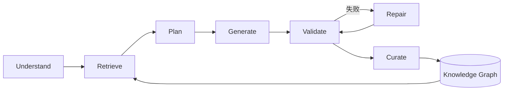
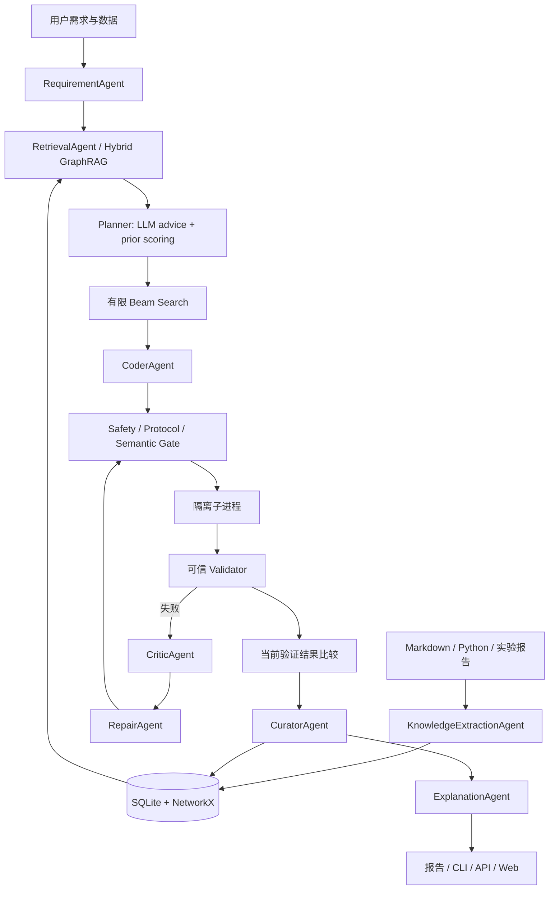
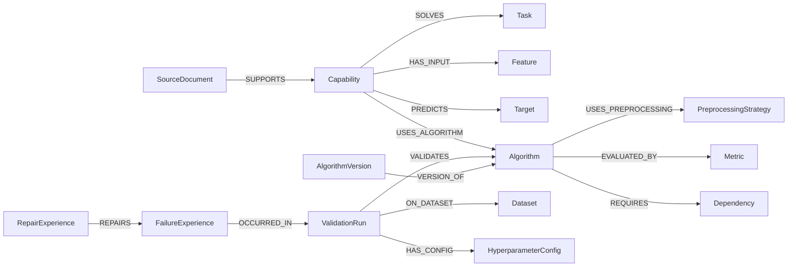
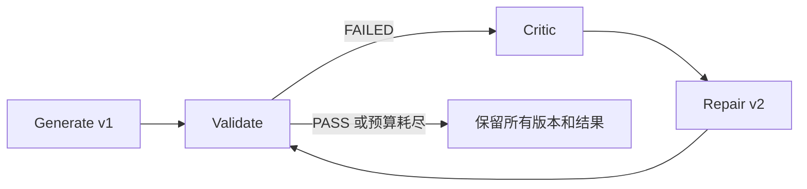
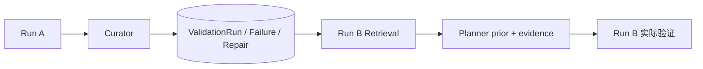
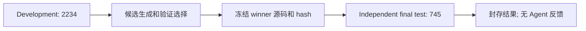

# AI Algorithm Factory

**基于 AI Agent 的算法能力工厂**

从自然语言算法需求和历史知识出发，经能力理解、知识抽取、GraphRAG、方案规划、代码生成、自动验证、代码修复和经验沉淀形成闭环的 Multi-Agent 原型。主场景为**合成客户流失预测**，跨场景验收为**公开文本情感分类**。

| 项目成果 | 实现与结果 |
|---|---|
| 真实本地 LLM | Qwen2.5-14B-Instruct：理解/抽取/规划/诊断/解释；Qwen3-Coder-30B-A3B-Instruct：生成/修复 |
| 图与经验进入执行 | GraphRAG 子图进入 Planner；真实运行 A 写回后被任务 B 检索 |
| 搜索与验证 | 有限 Beam、多候选实跑、可信指标重算、版本化修复、CLI/API/Web |
| 封存结果 | 客户流失 ROC-AUC **0.9289**、F1 **0.3934**；公开文本独立最终测试 Accuracy **0.8242**、Weighted F1 **0.8241** |

目录：[1 背景](#1-项目背景和目标) · [2 架构](#2-系统架构和模块设计) · [3 图谱](#3-能力知识图谱-schema-和示例) · [4 工作流](#4-agent-工作流设计) · [5 运行](#5-环境配置和运行方法) · [6 数据与实验](#6-示例数据和测试任务说明) · [7 代码示例](#7-生成算法代码示例) · [8 结果与评分证据](#8-验证结果和报告样例) · [9 挑战](#9-遇到的挑战和解决方案) · [10 扩展](#10-后续可扩展方向)。

## 1. 项目背景和目标

### 1.1 背景

算法开发通常需要人工理解需求、选择算法、编写代码和测试；预处理方法、调参经验、失败案例和业务约束则散落在文档、代码与实验记录中。单次代码生成难以同时保证接口正确、指标可信和经验可复用。

本项目将这些材料转为带来源的结构化知识，使自然语言需求经过可追踪的规划、执行和反馈，最终得到可运行代码、验证报告和可供后续任务检索的经验。

### 1.2 项目目标

基于已有 **LLM + Agent workflow + Knowledge Graph + Validator**，实现从算法需求到可运行代码与验证报告的能力工厂。目标包括当前任务的代码修复闭环，以及跨任务的外部经验复用。每项功能都以执行路径和保存的 evidence 为依据。

### 1.3 核心闭环



### 1.4 原题核心要求完成情况

| 原题核心要求 | 状态 | 实现与证据 |
|---|---|---|
| LLM 能力理解、抽取、生成或修复 | ✅ | [Agent 实现](app/agents/)、[真实调用与修复](docs/FINAL_ACCEPTANCE.md) |
| 具体行业场景 | ✅ | 客户流失与评论分类；[数据和任务](#6-示例数据和测试任务说明) |
| 能力知识库/知识图谱 | ✅ | SQLite、NetworkX、GraphML、GraphRAG；[Schema](docs/knowledge_graph_schema.md) |
| 自然语言到可运行代码 | ✅ | [Workflow](app/workflow.py) 串联理解、Planner、Coder 和 Validator |
| 统一验证机制 | ✅ | [ValidationRunner](app/validation/runner.py) 检查功能、指标、稳定性、接口等 |
| 简洁用户接口 | ✅ | [CLI](app/cli.py)、[FastAPI](app/api.py)、[Web](app/ui/) |

## 2. 系统架构和模块设计

### 2.1 总体架构



完整图集见 [ARCHITECTURE.md](docs/ARCHITECTURE.md)。知识抽取在材料入库阶段执行，已抽取材料按源文件内容 hash 缓存复用。

### 2.2 分层职责与主要代码目录

```text
app/
├── agents/       需求、抽取、建议、规划、生成、诊断、修复、解释、写回
├── knowledge/    AST/文档抽取、bootstrap、SQLite 与 NetworkX 同步
├── retrieval/    实体链接、图遍历、子图序列化、文档向量/词项融合
├── experience/   数据画像相似度、历史 prior、失败经验检索
├── search/       算法×预处理×参数的有限状态扩展与剪枝
├── generation/   任务契约、CodeIR 编译、显式模板路径
├── execution/    候选执行、修复循环与不可变源码版本
├── validation/   静态检查、沙箱 worker、可信指标与报告
├── plugins/      算法/任务插件注册
├── metrics/      指标方向、阈值与自定义 evaluator
├── llm/          provider 路由、JSON transport、重试、脱敏与计量
├── ui/           报告、相关子图、源码与修复链界面
├── api.py        FastAPI 和自动 OpenAPI 文档
├── cli.py        命令行入口
└── workflow.py   调度已有职责组件
experiments/ablation/  独立协议、实验适配器、原始结果与汇总
tests/                 软件单元/集成测试
```

Agent Layer 处理职责与结构化消息；Knowledge Layer 保存可查询知识；Search/Planning Layer 生成可执行候选；Code Generation Layer 产出源码；Execution/Validation Layer 决定是否通过；Experience Layer 保存每次尝试；Interface Layer 提供提交和检查入口。实验目录通过独立配置组装同一套工作流。

### 2.3 技术选择及理由

| 技术 | 选择理由 |
|---|---|
| Python / Pydantic | 适合数据处理；严格交换契约可发现 JSON 类型、字段和语义不一致 |
| SQLite | 无需数据库服务，可随实验隔离与复制；保留完整结构化 payload |
| NetworkX / GraphML | 可解释的关系遍历与子图操作；GraphML 用于快照与展示，子图序列化结果进入 LLM 上下文 |
| 本地 embeddings / TF-IDF | 本地 text2vec 进行语义相似度；可配置 TF-IDF 词项检索，报告分别记录检索后端 |
| scikit-learn | 小型分类/回归任务实现透明、训练成本可控、指标可在可信端重算 |
| OpenAI-compatible API / Qwen | 模型服务与应用解耦；指令模型和代码模型按职责路由，调用可计量 |
| FastAPI | 同时提供 API、OpenAPI 文档和轻量 Web 证据界面 |

### 2.4 运行方式与配置

系统采用同步、单用户的 specialist Multi-Agent 原型，各角色具有输入输出契约、prompt、工具权限与失败处理。生成代码通过 prototype sandbox 执行，支持静态检查、子进程隔离和资源约束；执行防护范围见 [安全策略](docs/llm_and_security.md)。配置集中在 [config.py](app/config.py)，算法与指标通过 [插件注册](app/plugins/registry.py) 和 [指标注册](app/metrics/registry.py) 扩展。

## 3. 能力知识图谱 Schema 和示例

### 3.1 图谱建模目标

知识图谱统一表示任务、算法、数据、验证结果和修复经验。`Task → Algorithm → ValidationRun → Dataset / Failure / Repair` 的关系连接算法适用条件、实验配置与历史表现，为方案规划提供结构化检索依据。

### 3.2 Entity Schema

| 实体 | 含义 |
|---|---|
| Capability / Task / Algorithm | 可复用能力、待解决任务、算法方法 |
| Dataset / Feature / Target | 数据画像、输入字段、预测目标；输入与标签分开 |
| PreprocessingStrategy / HyperparameterConfig | 预处理策略和一次具体配置 |
| Metric / Constraint | 指标定义、优化方向与验收约束 |
| Dependency / Environment | 包依赖与实际运行环境 |
| ValidationRun | 某次任务、数据、代码版本的实测结果 |
| FailureExperience / RepairExperience | 根因、触发条件、修复动作、是否成功与可复用教训 |
| SourceDocument | 文件、原文跨度、chunk、hash 与来源定位 |
| AlgorithmVersion | 源码 hash、父版本、验证时间与版本归属 |

### 3.3 Relation Schema



关系类型、方向、补充环境/版本关系和设计理由见 [knowledge_graph_schema.md](docs/knowledge_graph_schema.md)；[Schema 校验](app/knowledge/schema.py) 与 [关系测试](tests/test_relation_schema.py) 约束实体类型。图中的 `ON_DATASET` 从 ValidationRun 指向 Dataset。

### 3.4 真实实体与测量示例

正式 [extracted_knowledge.json](examples/acceptance_real_20260907/extracted_knowledge.json) 中：**`age → Feature`、`churn → Target`、`ROC-AUC → Metric`**。例如客户流失 Capability 使用 Logistic Regression，具体 ValidationRun 再关联算法与客户数据集。

`ROC-AUC=0.9288770969` 保存为运行 `6bde3f2c39b8` 的实测属性，并关联该次实验的数据、配置、代码版本和时间。runtime、memory、timestamp、success 同样保存在 ValidationRun 中，使每项测量都有明确的实验上下文。

### 3.5 知识来源与 provenance

| 来源 | 抽取过程 | 可追踪内容 |
|---|---|---|
| Markdown / TXT | LLM 抽取能力、任务、算法、指标、约束和专家经验 | 文件、原文跨度、chunk、偏移和 hash |
| Python source | AST 可靠提取 imports/functions/classes/signatures，再由 LLM 理解算法语义 | 静态结构与语义断言各自保留来源 |
| 实验 JSON / Validation report | LLM 提取任务、配置、指标、资源、失败与策略 | 来源实验及其段落，标记为文档抽取知识 |
| 当前 Validator 结果 | Curator 写回全部候选与修复版本 | measured_workflow、代码 hash、环境与实际指标 |

入口为 [KnowledgeBootstrapper](app/knowledge/bootstrap.py) 与 [抽取组件](app/knowledge/)。Python 文件采用 AST + LLM 联合分析，抽取结果保留来源跨度与实体引用，并通过校验后入库。

### 3.6 GraphRAG 的实际使用

`Requirement → Entity Linking → 关系感知的 1–3 hop Graph Traversal → Relevant Subgraph → SubgraphSerializer → Planner Context`。

在真实第二次客户流失任务中，结构化查询得到 `binary_classification / churn / ROC-AUC / imbalance / probability`，链接能力、任务和兼容算法；返回 **60 nodes、149 edges、8 条 embedding 文档证据、6 条历史案例**。路径示例：

```text
capability_fe3d4b64611b254d
  ← VALIDATES ← 6bde3f2c39b8

capability_fe3d4b64611b254d
  → USES_ALGORITHM → algorithm_random_forest
  ← RELATED_TO ← failure_6bde3f2c39b8_..._v4
```

这是两条从能力/算法扩展到实测运行和失败经验的路径。方向、距离、任务兼容性与关系权重参与评分；Metric/Dependency hub 的跨任务扩展受限。文档向量分数与 graph distance、task compatibility、recency、validation quality 融合。

LLM 接收分开的 `requirement`、`graph_candidates`、`similar_historical_runs`、`failure_and_repair_experiences`、`source_evidence`、`system_constraints` JSON，并引用允许的 evidence IDs。完整来源：[实际子图示例](examples/acceptance_real_20260907/graph_retrieval_example.json)、[真实 Planner 上下文](examples/acceptance_real_20260907/closed_loop_proof.json)、[Serializer](app/retrieval/graph.py)、[上下文压缩](app/agents/planning_context.py)。

## 4. Agent 工作流设计

### 4.1 职责与交换契约

| Agent / 职责 | 输入 | 输出 | LLM |
|---|---|---|---|
| RequirementUnderstandingAgent | 需求、可信 CSV schema/profile | CapabilitySpec 与恢复 trace | 是 |
| KnowledgeExtractionAgent | 文档/代码/报告 | 来源化实体、关系 | 是，Python 另用 AST |
| RetrieverAgent | Spec、图和文档、案例 | KnowledgeContext / 子图 | 图与案例确定性；文档可用 embedding |
| PlannerAgent（Advisor + scorer） | Requirement、Evidence、约束 | 多个 AlgorithmPlan、依据与 prior 分解 | 是 + 确定性评分 |
| CoderAgent（GeneratorAgent） | Plan、契约、检索上下文 | 完整 Python 模块 | 正常路径是 |
| ValidatorAgent（ValidationRunner） | Code、Data、Spec | ValidationResult | 否 |
| CriticAgent | 失败报告、源码、经验 | 根因与修复建议 | 是 |
| RepairAgent | Code、Error、metric gap、约束 | diagnosis/strategy/revised code | 是 |
| CuratorAgent | 全候选、全部版本、结果 | KG 更新 | 否 |
| ExplanationAgent | 检索依据、实际比较结果 | 选择理由与局限 | 是 |

具体 prompt/schema/error recovery 见 [agents](app/agents/) 和 [LLM contracts](app/llm/contracts.py)。[AgentRuntime](app/agents/protocol.py) 限制角色工具分派并记录事件。各步骤通过独立调用交换结构化结果，形成可追踪的职责协作。

### 4.2 原题 a–g 映射与任务内修复

| 原题流程 | 实际入口 |
|---|---|
| a 理解需求 | [requirement_agent.py](app/agents/requirement_agent.py) |
| b 检索知识 | [retriever.py](app/knowledge/retriever.py) |
| c 规划方案 | [advisor_agent.py](app/agents/advisor_agent.py)、[planner_agent.py](app/agents/planner_agent.py) |
| d 生成代码 | [generator_agent.py](app/agents/generator_agent.py) |
| e 执行验证 | [runner.py](app/validation/runner.py) |
| f 修复/优化 | [critic_agent.py](app/agents/critic_agent.py)、[repair_agent.py](app/agents/repair_agent.py) |
| g 沉淀 | [curator_agent.py](app/agents/curator_agent.py) |



默认最多 3 轮运行后修复；无改动的修复不计为成功。每轮保留代码、错误、诊断、版本 hash 和 parent version。静态/语义生成门禁还有最多两次生成尝试；两类重试在消融中分别计量。

### 4.3 跨任务经验闭环



经验复用采用 **external memory / case-based reasoning**。不同来源的实验声明与本系统实测经验分层；seed_data 中的 historical_metrics 仅为冷启动弱 prior，实测统计由 ValidationRun 提供。每个候选、失败与修复版本都沉淀。实际 Workflow → Curator → Retrieval → Planner 链路见 [closed_loop_proof.json](examples/acceptance_real_20260907/closed_loop_proof.json)。

### 4.4 Planner 与 Beam Search

搜索状态为 **Algorithm + Preprocessing + HyperparameterConfig**。Logistic、Random Forest、Gradient Boosting 的基础配置与 LLM 参数建议构成候选；真实客户任务扩展 **15 states，剪枝 12，执行 3**。公开文本任务是一个 TF-IDF + Logistic 插件扩展 **4 states，剪枝 1，执行 3**。

[BeamSearchPlanner](app/search/beam.py) 在有限配置空间内进行一轮组合状态扩展、评分与多样性选择，记录每个状态及剪枝理由。候选经过实际执行，最终按当前可信验证结果选择 winner。

### 4.5 经验先验与候选探索

[ExperienceRetriever](app/experience/retriever.py) 综合 task/data/feature/sample-size/class-balance similarity、历史表现、成功率、稳定性、资源、recency，并按有效样本量收缩 prior；加入 `1/sqrt(1+n)` exploration bonus。用户解释性与延迟要求参与排序，Beam 保留不同算法。

**Knowledge Graph 提供 prior，当前 validation 决定最终选择。** [闭环反例测试](tests/test_measured_closed_loop.py) 在新的非线性数据上执行候选，验证历史偏好线性模型仍可能被当前更合适的算法取代。当前权重是可解释启发式，修复版本之间存在相关性。

## 5. 环境配置和运行方法

### 5.1 Python 环境

推荐 Linux、Python 3.10。应用通过本机或远端 API 调用模型，应用进程可在 CPU 环境运行。

```bash
git clone https://github.com/cucu220123/ai_agent.git
cd ai_agent
python -m venv .venv
source .venv/bin/activate
pip install -r requirements.txt
```

| 环境 | 依赖 | 用途 |
|---|---|---|
| Minimal | [requirements.txt](requirements.txt) | 应用、API 调用、验证、Mock CI |
| Local LLM | [requirements-local.txt](requirements-local.txt) | Transformers、本地 embedding、可选权重量化 |
| Model service | [requirements-serving.txt](requirements-serving.txt) | 独立 vLLM 环境；避免与应用环境混装 |

根依赖为兼容范围，实际测量依赖版本另存于正式环境 evidence 和消融 protocol。Linux 环境支持 resource 检查及可用时的 namespace 隔离。证据按原始字节校验；Windows clone 复查时设置 `core.autocrlf=false`，以保持源码和数据的原始字节。

### 5.2 Mock / CI 模式

```bash
LLM_PROVIDER=mock ENABLE_LOCAL_EMBEDDING=0 python -m scripts.run_demo
```

Mock 用于离线软件流程和模板测试；真实模型验收使用显式配置的 API provider，并记录模型来源与调用状态。

### 5.3 真实本地 LLM 模式

正式 acceptance 的最终模型路由：Qwen2.5-14B-Instruct 负责理解、抽取、Planner、Critic、解释；Qwen3-Coder-30B-A3B-Instruct 负责 Coder/Repair。最终服务使用 BF16、32768 context，代码模型 TP=2。以下 GPU 编号/显存比例需要按空闲资源设置，在独立模型服务环境的两个终端启动：

```bash
CUDA_VISIBLE_DEVICES=0 python -m vllm.entrypoints.openai.api_server \
  --model /path/to/Qwen2.5-14B-Instruct --served-model-name Qwen2.5-14B-Instruct \
  --dtype bfloat16 --max-model-len 32768 --gpu-memory-utilization 0.48 \
  --max-num-seqs 1 --max-num-batched-tokens 1024 --enforce-eager \
  --host 127.0.0.1 --port 18106 --no-enable-log-requests

CUDA_VISIBLE_DEVICES=1,2 python -m vllm.entrypoints.openai.api_server \
  --model /path/to/Qwen3-Coder-30B-A3B-Instruct --served-model-name Qwen3-Coder-30B-A3B-Instruct \
  --tensor-parallel-size 2 --dtype bfloat16 --max-model-len 32768 \
  --gpu-memory-utilization 0.46 --max-num-seqs 2 --max-num-batched-tokens 2048 \
  --enforce-eager --host 127.0.0.1 --port 18108 --no-enable-log-requests
```

回到应用环境：

```bash
export LLM_PROVIDER=openai
export OPENAI_BASE_URL=http://127.0.0.1:18106/v1
export OPENAI_API_KEY=local-only
export OPENAI_MODEL=Qwen2.5-14B-Instruct
export OPENAI_CODER_BASE_URL=http://127.0.0.1:18108/v1
export OPENAI_CODER_MODEL=Qwen3-Coder-30B-A3B-Instruct
export EMBEDDING_MODEL_PATH=/path/to/shibing624-text2vec-base-chinese
export AI_FACTORY_TRACE=1
python -m scripts.run_demo
```

`local-only` 是本地无鉴权服务占位符，不是云端凭据。真实凭据通过环境或显式外部配置读取，不写源码/Git；日志统一脱敏。模型权重需提前提供；加载禁用 `trust_remote_code`。没有 vLLM 时可用 [serve_local_llm.py](scripts/serve_local_llm.py) 的 Transformers 服务，性能与量化结果应另行报告。

### 5.4 CLI

```bash
python -m scripts.generate_demo_data --output data/churn_demo.csv
python -m app.cli run --description "预测客户流失，ROC-AUC 不低于 0.8，输出概率" \
  --data data/churn_demo.csv --provider openai --beam-width 3 --max-repairs 3
python -m app.cli ingest data/business_material.md --provider openai
python -m app.cli knowledge
python -m app.cli plugins
```

### 5.5 FastAPI

```bash
uvicorn app.api:app --host 127.0.0.1 --port 8000
```

`/docs` 是自动 OpenAPI 文档；接口包括 `POST /run`、`POST /knowledge/ingest`、`GET /reports`、`GET /run/{id}`、`GET /run/{id}/code`。路径限定在工作目录内，源码读取绑定报告登记的 artifact。

### 5.6 Web

浏览 `http://127.0.0.1:8000/ui`：提交需求、查看结构化 Spec、相关子图/路径、Planner/Beam 排名、生成代码、验证、版本修复链、winner 和写回。支持按 ValidationRun / FailureExperience / RepairExperience 筛选，`/graph/subgraph?focus=run_id` 查看运行相关子图。

可设置 `AI_FACTORY_WORKSPACE=/path/to/new_workspace` 隔离数据库、数据、产物和报告。API 提供本机同步任务执行与报告查询，已保存报告可直接查看。

### 5.7 自动测试

```bash
python -m pytest -q
```

自动测试结果为 **103 passed，98 warnings，72.11 秒**，见 [pytest 原始输出](docs/ablation_checks/pytest.log)。测试使用独立 workspace 和显式 Mock/fixture，覆盖单元测试与 subprocess 集成检查。真实模型调用及结果分别记录于验收和消融报告。

### 5.8 消融实验

```bash
# 对已保存结果只做汇总，不调用模型
python experiments/ablation/summarize_ablation.py

# 完整复现实验使用新目录；先固定 protocol，再执行同一调度
python experiments/ablation/run_ablation.py --output experiments/ablation/results/reproduction --prepare-only
python experiments/ablation/run_ablation.py --output experiments/ablation/results/reproduction
python experiments/ablation/summarize_ablation.py --output experiments/ablation/results/reproduction
```

运行命令使用 5.3 的两个 loopback 模型服务。默认目录用于读取和汇总已保存结果；复现实验使用独立 output 目录。实验协议、配置开关和复现方法见 [实验说明](experiments/ablation/README.md)。

## 6. 示例数据和测试任务说明

### 6.1 Customer Churn

| 项目 | 说明 |
|---|---|
| 来源 | [生成器](scripts/generate_demo_data.py) 生成 synthetic data，**合成客户数据** |
| 输入 | age、region、login_count_30d、total_spend、complaint_count、membership_level、tenure_months |
| Target / task | churn；表格二分类 |
| 业务目标 | 根据使用行为识别未来流失风险，输出 prediction 与 probability |
| 指标 | ROC-AUC、F1、Precision、Recall；消融另保留 PR-AUC 等可信指标 |
| 正式主验收 | 1200 条，ROC-AUC 阈值 0.80；F1 作为附加观测指标 |

示例业务材料：[business_material.md](data/business_material.md)、[reference_preprocessing.py](data/reference_preprocessing.py)。缺失值、类别变量与不平衡包含在模拟材料和执行检查中。

### 6.2 Public Text Classification

公开语料为 UCI Sentiment Labelled Sentences（Kotzias，2015，DOI 10.24432/C57604，CC BY 4.0），包含产品、电影和餐馆评论。原始 3000 条按规范化文本去重后为 2979 条，固定分层为 **development=2234、independent final test=745**。来源、许可、原始行号和 hash 见 [data/uci_sentiment](data/uci_sentiment/) 与 [TEXT_ACCEPTANCE](docs/TEXT_ACCEPTANCE.md)。

输入 `text`，目标 `label`，输出 `prediction`；算法插件为 TF-IDF + Logistic Regression。预先规定 Accuracy 与 Weighted F1 均至少 0.70。公开文本实验与 16 行流程 smoke test 分别记录。

### 6.3 Final Test Protocol



`FinalHoldoutEvaluator` 在执行前绑定开发阶段选择报告、源码和数据。最终分数独立保存，Planner 与 Repair 仅使用开发阶段信息；相同 commitment 返回已有结果。

补充实验使用独立的 development/validation 数据和工作目录。客户流失正式验收与文本独立最终测试保持封存。

### 6.4 Cross-task Support

注册任务包含 binary classification、regression、text classification、anomaly detection。四类均有软件回归覆盖；真实重点验收为客户流失与公开文本，regression/anomaly 的真实模型实验规模较少。

有标签 anomaly 使用 F1/Precision/Recall。无标签任务输出 `anomaly_score`、`anomaly_rate`，并以 `runtime_seconds` 记录运行成本；这些统计分别描述异常输出与资源开销。算法质量的指标解释见 [异常检测评价说明](docs/acceptance_matrix.md#异常检测评价边界)。

### 6.5 补充实验设计

开发数据上的模块对照覆盖 GraphRAG、历史经验、Beam Search、多候选执行和代码修复。实验使用独立 SQLite、GraphML 和报告目录，配置、随机种子、模型调用与原始结果按任务保存。

完整设置与种子构成见 [消融实验报告](docs/ABLATION_STUDY.md)；复现入口见 [experiments/ablation](experiments/ablation/README.md)。

## 7. 生成算法代码示例

### 7.1 真实 LLM 模块

正式运行 `6bde3f2c39b8` 的 Logistic Regression v1 为 `code_source=llm`，可信验证 PASS。以下节选展示接口与实际实现片段，完整训练管线和指标计算见本节末尾的源码链接：

```python
def train(train_df, target_col, config=None):
    # 完整文件中构建缺失值填补、类别编码和 LogisticRegression Pipeline
    ...

def predict(model, test_df):
    predictions = model.predict(test_df)
    probabilities = model.predict_proba(test_df)[:, 1]
    return pd.DataFrame({'prediction': predictions, 'probability': probabilities})

def predict_proba(model, test_df):
    return model.predict_proba(test_df)[:, 1]

def evaluate(model, test_df, target_col):
    # 完整文件先分离 X/y，再计算 roc_auc、f1、precision、recall
    ...

def metadata():
    return {
        'algorithm': 'Logistic Regression',
        'rationale': 'Logistic Regression provides a simple baseline model and is interpretable.',
        'evidence_ids': [
            'source_reference_preprocessing_56f7c1fe',
            'source_business_material_1c1a6f4d',
            'preprocessingstrategy_build_preprocessor'
        ]
    }
```

[完整且不可变的生成源码](examples/acceptance_real_20260907/workspace/generated/6bde3f2c39b8/algorithm_logistic_regression__llm_proposed/versions/v1.py) 与 [原始运行报告](examples/acceptance_real_20260907/first.json)。该代码包含可执行的五个接口，metadata 的依据来自实际检索。

### 7.2 代码生成与门禁

`Requirement → Retrieved Knowledge → AlgorithmPlan → Coder → AST safety / import / protocol / semantic gate → Sandbox → trusted validation`。

Planner 给出设计与参数建议，Coder 生成完整源码，随后进入独立验证流程。静态检查限制导入/I/O 与接口，semantic gate 检查目标泄漏、已知 estimator 参数/预处理错误，实际执行再检查行为。生成内容和失败尝试都保留。

### 7.3 代码来源与版本记录

| 代码来源 | 生成方式 | 使用场景 |
|---|---|---|
| free-form LLM / `llm` | 模型生成完整代码 | 真实验收中的初始候选 |
| `repaired_llm` | 模型根据诊断修订代码并重新验证 | 真实自修复验收 |
| `structured_synthesis` / CodeIR | 中间表示的确定性编译 | 结构化生成与可复现基线 |
| template fallback | 按显式配置渲染算法模板 | 离线运行与 fallback |
| Mock CI | 模拟模型响应 | 软件流程测试 |

报告记录代码来源、配置建议与实际源码。`winner_config` 标识计划配置，实现细节以保存的源码为准。代码版本由 source hash、parent version 和 AlgorithmVersion 节点关联，每次生成和修复均保留独立版本。

## 8. 验证结果和报告样例

本节展示真实模型的端到端验收、冻结代码后的独立测试，以及自修复和跨任务经验复用结果。开发数据上的补充研究另附独立报告。

### 8.1 自动验证机制

**验证指标由可信父进程独立重算。** 父进程根据子进程返回的预测计算指标，并检查生成模块 `evaluate` 的结果是否一致。

| 维度 | 实际检查 |
|---|---|
| Functional | 输出行数、列、类型、NaN/Inf、概率范围与接口一致性 |
| Metric | 父进程重算主/次指标、阈值和自报一致性；可选 CV |
| Stability | 同 seed 重复、跨 seed 方差；超出阈值失败 |
| Interface | train/predict/evaluate/metadata 严格签名；按任务要求概率接口 |
| Semantic | 静态目标列排除、复制标签泄漏、已知无效 estimator 参数 |
| Robustness | 缺失值、未见类别/词、小批、单行、空/无效输入行为 |
| Security | AST/import、临时目录、隔离 subprocess、超时/进程组终止、环境清理和 audit |
| Resource | runtime、RSS、CPU、预测时延；CPU/address-space/file-size 限额 |

实现：[runner](app/validation/runner.py)、[validation](app/validation/)、[指标可信性测试](tests/test_validation_integrity.py)。Linux 环境可结合 network namespace 增强执行防护；沙箱机制与适用范围见 [安全策略](docs/llm_and_security.md)。

### 8.2 Customer Churn 正式结果

| 项目 | 封存测量 |
|---|---|
| Run / data | `6bde3f2c39b8` / 1200 行 synthetic customer data |
| Winner / code source | Logistic Regression / `llm` v1 |
| ROC-AUC | **0.9288770969** |
| F1 / recall | **0.3934426230** / 约 0.261 |
| 其他候选 | Gradient Boosting PASS、AUC 0.8928449161；Random Forest FAILED |

该实验使用合成数据，ROC-AUC 衡量预测排序表现；默认分类阈值下 F1 为 0.3934、recall 约 0.261，结果按原型验证解释。数据划分与完整候选记录：[first.json](examples/acceptance_real_20260907/first.json)、[FINAL_ACCEPTANCE](docs/FINAL_ACCEPTANCE.md)。

### 8.3 Text Independent Final Test

| 阶段 | 样本数 | Accuracy | Weighted F1 |
|---|---:|---:|---:|
| Development 内选出的 bigram 候选 | 2234 内部训练/验证 | 0.8014311270 | 0.8014235011 |
| 冻结代码后独立最终测量 | 全 2234 训练、745 最终测试 | **0.8241610738** | **0.8241382607** |

Run=`683902e2a7cf`，三个开发候选全部 v1 PASS，无运行后修复；7 次真实 API 调用，需求 JSON 有一次应用侧恢复。最终数据/分数未反馈到 Agent。证据：[TEXT_ACCEPTANCE](docs/TEXT_ACCEPTANCE.md)、[final_evaluation](examples/acceptance_text_20260908/final_evaluation/)。结果对应公开语料的混合来源分层切分。开发与最终阶段采用不同训练量和评估数据，分别报告测量值。

### 8.4 Self-Repair：受控与自然失败

| 类型 | 实际证据 | 验证对象 |
|---|---|---|
| Controlled repair fixture | `53ac387cea5c`：人为将 predict 改为 predict_broken；v1 FAILED → Qwen 真实修复 → v2 PASS，AUC 0.8888223211 | 受控接口故障下的修复执行链、代码版本与接口恢复 |
| Natural failures | 旧文本 `a054aaacecab` 存在 TF-IDF 参数错投、预处理维度与 weighted F1 自报错误；部分配置修复后通过，另一个三轮后仍失败 | 自然生成错误的诊断、修复结果与尝试记录 |

Controlled 案例保存 [before/after/diagnosis/validation](examples/acceptance_real_20260907/self_repair_demo/)，原失败与新版本 SHA256 不同，约 132.37 秒真实修复调用可追踪。自然错误见 [原文本运行](examples/acceptance_real_20260907/cross.json) 和 [验收分析](docs/FINAL_ACCEPTANCE.md)。自然错误与受控故障分别记录。

### 8.5 Experience Closed Loop

| 链路 | 实际记录 |
|---|---|
| First retrieval | 历史案例为空 |
| Workflow → Curator | 写入 `6bde3f2c39b8` 及全部候选/失败/版本 |
| Next workflow | `9364e416a38a`，另一批 1050 行合成数据和新约束 |
| Next retrieval | 再次找到 `6bde3f2c39b8`，context similarity 约 **0.98294** |
| Planner 使用 | Run ID 出现在实际 LLM context 和计划 evidence IDs；Logistic 提议分数由 0.7900 变为 1.336199 |

两次均扩展 15 状态并实际执行 3 类算法。[closed_loop_proof.json](examples/acceptance_real_20260907/closed_loop_proof.json) 保存“写回→再检索→规划使用”的完整来源链。两次任务采用不同数据与约束，该记录用于核验跨任务经验使用过程。

### 8.6 补充实验报告

开发/验证数据上的 25 次模块对照及原始记录见 [消融实验报告](docs/ABLATION_STUDY.md)。报告按各组实际样本数列出全部设置的预测指标、候选结果、修复和运行成本，并使用共同种子进行配对分析。

### 8.7 进阶功能实现

| 进阶功能 | 具体实现 | 代码或证据 |
|---|---|---|
| Web / CLI / API | 本机任务提交、执行与报告查询 | [API](app/api.py)、[CLI](app/cli.py)、[UI](app/ui/) |
| 多轮代码修复 | 默认最多 3 轮，保留诊断和源码版本 | [候选执行与修复循环](app/execution/candidates.py) |
| 多候选方案比较 | Beam 保留候选，依据实际验证结果选择 | [Beam Search](app/search/beam.py) |
| 知识图谱可视化 | 相关子图、路径、ValidationRun 与失败/修复筛选 | [Web 界面](app/ui/) |
| 自动验证报告 | 生成 JSON 与 Markdown 报告 | [报告模块](app/validation/report.py) |
| 验证结果回写 | Curator 保存候选、运行、失败和修复经验 | [跨任务闭环](examples/acceptance_real_20260907/closed_loop_proof.json) |
| 多任务验证配置 | 分类、回归、文本和异常任务的协议及指标配置 | [任务与验证说明](#6-示例数据和测试任务说明) |
| 插件式接入 | 注册算法 renderer、自定义指标与 evaluator | [插件扩展测试](tests/test_plugin_extension.py) |

### 8.8 扩展能力与加分项实现

| 已实现能力 | 实现范围与证据 |
|---|---|
| 图搜索 | GraphRAG 关系感知遍历、路径评分与子图检索 |
| Beam Search | 有限算法/预处理/参数空间的状态扩展与剪枝 |
| 多智能体协作 | 独立职责、schema、prompt、工具权限和调用 trace |
| Python 代码能力抽取 | 文件级 AST 结构分析与 LLM 语义抽取，保留来源跨度 |
| 代码安全检查与沙箱执行 | prototype sandbox：AST/import、子进程、资源限额和 audit |
| 失败案例与经验复用 | Failure/RepairExperience 写回，并被下一次任务检索 |
| 算法能力版本管理 | source hash、parent version、ValidationRun 与 AlgorithmVersion |
| 自然语言设计依据 | ExplanationAgent 引用检索 evidence 与实测结果 |
| 跨场景验证 | 同一框架完成客户流失预测与公开文本分类 |
| 自动接口文档 | FastAPI 生成 OpenAPI 文档 |
| 资源消耗分析 | 记录 CPU、RSS、runtime 和预测时延 |

### 8.9 评分标准对应证据

以下按原题评分维度列出代码和实验依据。

#### 技术能力 — 40%

| 评分点 | 本项目证据 |
|---|---|
| 能力抽取—复刻—验证—沉淀闭环 | [Workflow](app/workflow.py)、[正式闭环](examples/acceptance_real_20260907/closed_loop_proof.json) |
| LLM Agent、代码生成与验证理解 | 真实 Qwen 调用、严格 JSON/代码契约、可信指标重算；见 4、7、8.1 |
| KG schema 合理性 | Feature/Target/Metric 分离、运行级数值、来源和版本；见 3 |
| Agent 工作流清晰有效 | 角色表、a–g 映射、任务内与跨任务两条反馈链；见 4 |
| 验证可执行/可扩展 | [ValidationRunner](app/validation/runner.py)、[MetricRegistry](app/metrics/registry.py)、tests |
| 修复/候选/搜索能力 | 15→3 实际搜索、FAILED→REPAIR→PASS、全候选比较、正式修复验收 |

#### 代码质量 — 30%

| 评分点 | 本项目证据 |
|---|---|
| 规范、模块化、接口清晰 | app 各职责目录、Pydantic contracts、任务 API protocol |
| 错误处理与日志 | [计量](app/llm/telemetry.py)、有界恢复、failure.json、事件序列、脱敏 |
| 运行与复现 | 5 节命令、requirements、实验 protocol/commit/hash、独立 workspace |
| 自动测试 | schema/图/闭环/子进程/安全/超时/稳定性/指标造假/插件/消融隔离 |
| 避免不可维护硬编码 | 算法/指标注册、集中 Settings；搜索策略仍有有限启发式 |
| Git 管理 | 代码、预注册协议、结果与报告分阶段提交；源码版本另有 hash 链 |

#### 创新性 — 15%

| 评分点 | 本项目证据 |
|---|---|
| Agent 协作机制 | 角色受限的工具调度、结构化 evidence 交换、可恢复诊断 |
| KG 增强生成/验证 | GraphRAG 关系路径与历史案例进入实际 Planner/Coder |
| 搜索/自修复 | 算法×预处理×配置 Beam；真实 Critic/Repair 与版本化执行 |
| 失败经验沉淀 | 失败及修复写回后再检索，不只保存 winner |
| 行业落地问题 | 标签泄漏、指标造假、资源限制、独立 final test 与消融隔离；生产能力边界明确 |

#### 完整性 — 15% 与基础交付清单

| 原题基础交付 | 文件/证据 |
|---|---|
| 完整代码库 | [app](app/)、[GitHub](https://github.com/cucu220123/ai_agent) |
| 示例行业数据、文档、材料 | [data](data/)、[数据说明](#6-示例数据和测试任务说明) |
| KG schema 设计 | [knowledge_graph_schema.md](docs/knowledge_graph_schema.md) |
| 知识抽取结果文件 | [正式抽取 JSON](examples/acceptance_real_20260907/extracted_knowledge.json) |
| Agent 工作流代码 | [workflow.py](app/workflow.py)、[ARCHITECTURE](docs/ARCHITECTURE.md) |
| 至少一个完整复刻示例 | [客户任务](examples/acceptance_real_20260907/first.json)、7 节完整源码 |
| 自动验证脚本 | [ValidationRunner](app/validation/runner.py)、[只读证据核验](scripts/verify_evidence.py) |
| 验证报告样例 | [FINAL_ACCEPTANCE](docs/FINAL_ACCEPTANCE.md)、[TEXT_ACCEPTANCE](docs/TEXT_ACCEPTANCE.md) |
| README 项目文档 | 本文件按原题十项提交内容组织 |
| 环境依赖 | [requirements.txt](requirements.txt)、本地推理/服务补充依赖 |
| 使用示例和测试用例 | 5 节命令、[tests](tests/)、[ablation](experiments/ablation/) |

代码、数据、文档、报告、CLI/API/Web 与端到端结果均可从上述入口核对。完整实验记录与指标解释分别附于验收和研究报告。

## 9. 遇到的挑战和解决方案

| 技术挑战 | 解决方案 | 执行结果与检查 |
|---|---|---|
| LLM 结构化输出的格式与语义校验 | Pydantic 契约、语义检查、受约束 transport 协商与有界重试 | 输出经过校验后进入下一 Agent，恢复过程保留 trace |
| 生成代码的接口与参数错误 | API protocol、semantic gate、Sandbox、Validator、Critic/Repair | 保存错误诊断和源码版本，修复后重新执行统一验证 |
| 图谱知识进入方案规划 | 图遍历、SubgraphSerializer、显式 Planner context | 报告保留检索路径、历史案例与 evidence IDs |
| 历史经验与候选探索的平衡 | 数据相似度、样本量收缩、recency、exploration、多候选实测 | 历史结果作为 prior，最终按当前验证结果选择 |
| 评价指标可信性与数据分离 | 父进程重算指标，开发阶段选择后冻结代码，独立测试单独保存 | 数据、源码和报告由 hash 绑定，最终分数与规划过程分离 |
| 模型推理与运行成本 | 指令/代码模型分别路由，vLLM 服务与调用计量 | 保存模型、上下文、时延、token usage 和候选资源统计 |

处理流程和实际执行记录见 [系统验收报告](docs/FINAL_ACCEPTANCE.md)、[文本独立测试报告](docs/TEXT_ACCEPTANCE.md) 与 [安全策略](docs/llm_and_security.md)。

## 10. 后续可扩展方向

| 方向 | 扩展内容 |
|---|---|
| 10.1 Large Repository Mining | 从单 Python 文件扩展到跨模块 call graph、dependency graph、语义和来源追踪 |
| 10.2 Production Sandbox | 低权限执行、只读挂载、Docker/gVisor、cgroups、seccomp、network namespace |
| 10.3 More Advanced Search | MCTS、learned policy、Bayesian optimization；与有限 Beam 在相同预算下比较 |
| 10.4 Better Experience Learning | 更丰富数据画像、相关版本去偏、case-based reasoning 权重学习与检索标注集 |
| 10.5 Unsupervised Anomaly Evaluation | 设计并验证无标签质量 proxy；继续区分异常统计、运行成本与可靠质量证据 |
| 10.6 Automatic Deployment | serving 配置、容器构建、认证、异步队列和生产部署 |
| 10.7 Automatic Performance Optimization | profiling、生成代码优化、模型压缩及质量/资源共同约束 |
| 10.8 Larger-scale Ablation | 更多 seeds、真实业务数据和任务；等预算比较、置信区间与更严格因果分析 |

后续实验采用独立目录与预先固定的评价协议，持续保存配置、代码版本和完整测量记录。
