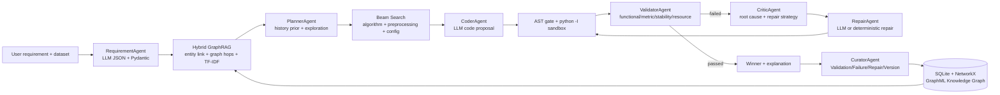
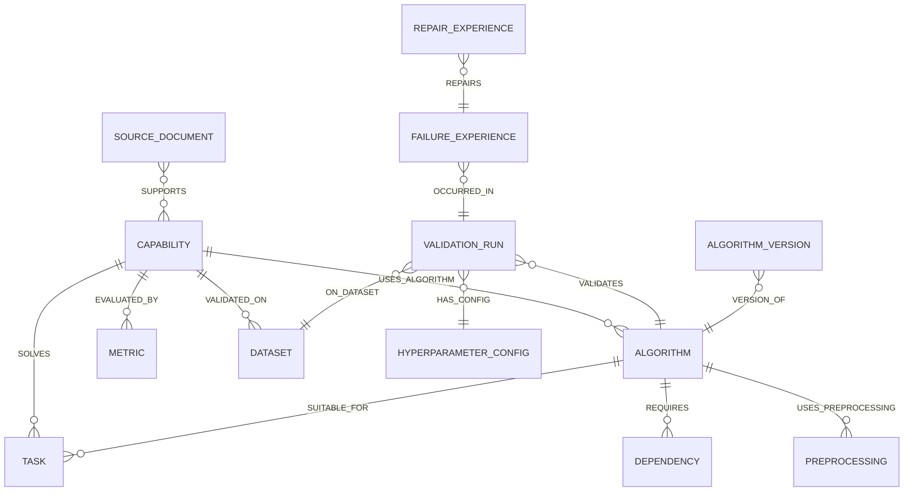
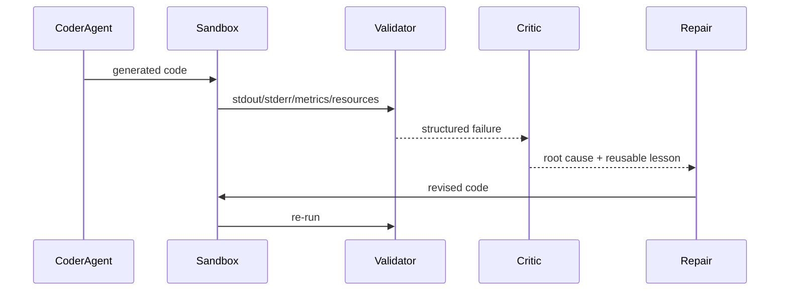
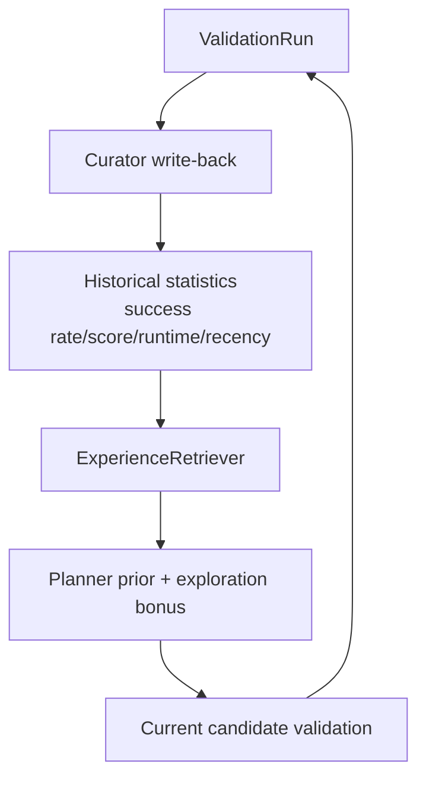

# AI Algorithm Factory Architecture

## End-to-end workflow

```mermaid
flowchart LR
  U[User requirement + dataset] --> R[RequirementAgent\nLLM JSON + Pydantic]
  R --> G[Hybrid GraphRAG\nentity link + graph hops + TF-IDF]
  G --> P[PlannerAgent\nhistory prior + exploration]
  P --> B[Beam Search\nalgorithm + preprocessing + config]
  B --> C[CoderAgent\nLLM code proposal]
  C --> S[AST gate + python -I sandbox]
  S --> V[ValidatorAgent\nfunctional/metric/stability/resource]
  V -->|failed| K[CriticAgent\nroot cause + repair strategy]
  K --> A[RepairAgent\nLLM or deterministic repair]
  A --> S
  V -->|passed| W[Winner + explanation]
  W --> Q[CuratorAgent\nValidation/Failure/Repair/Version]
  Q --> KG[(SQLite + NetworkX\nGraphML Knowledge Graph)]
  KG --> G
```

## Knowledge graph schema

```mermaid
erDiagram
  CAPABILITY ||--o{ TASK : SOLVES
  CAPABILITY ||--o{ ALGORITHM : USES_ALGORITHM
  ALGORITHM ||--o{ TASK : SUITABLE_FOR
  ALGORITHM ||--o{ DEPENDENCY : REQUIRES
  ALGORITHM ||--o{ PREPROCESSING : USES_PREPROCESSING
  CAPABILITY ||--o{ METRIC : EVALUATED_BY
  CAPABILITY ||--o{ DATASET : VALIDATED_ON
  VALIDATION_RUN }o--|| ALGORITHM : VALIDATES
  VALIDATION_RUN }o--|| DATASET : ON_DATASET
  VALIDATION_RUN }o--|| HYPERPARAMETER_CONFIG : HAS_CONFIG
  FAILURE_EXPERIENCE }o--|| VALIDATION_RUN : OCCURRED_IN
  REPAIR_EXPERIENCE }o--|| FAILURE_EXPERIENCE : REPAIRS
  SOURCE_DOCUMENT }o--o{ CAPABILITY : SUPPORTS
  ALGORITHM_VERSION }o--|| ALGORITHM : VERSION_OF
```

## Self-repair loop

```mermaid
sequenceDiagram
  participant C as CoderAgent
  participant S as Sandbox
  participant V as Validator
  participant X as Critic
  participant R as Repair
  C->>S: generated code
  S->>V: stdout/stderr/metrics/resources
  V-->>X: structured failure
  X-->>R: root cause + reusable lesson
  R->>S: revised code
  S->>V: re-run
```

## Experience learning loop

```mermaid
flowchart TB
  A[ValidationRun] --> B[Curator write-back]
  B --> C[Historical statistics\nsuccess rate/score/runtime/recency]
  C --> D[ExperienceRetriever]
  D --> E[Planner prior + exploration bonus]
  E --> F[Current candidate validation]
  F --> A
```

