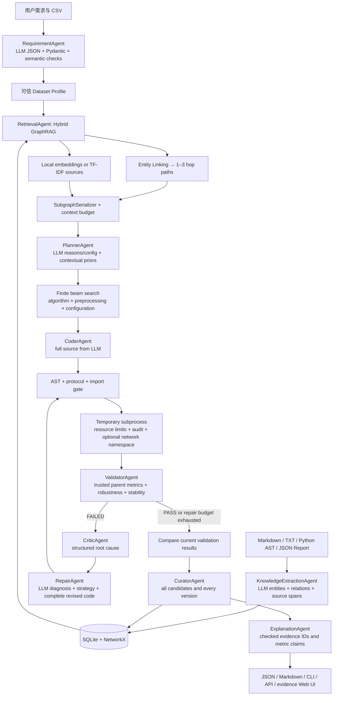
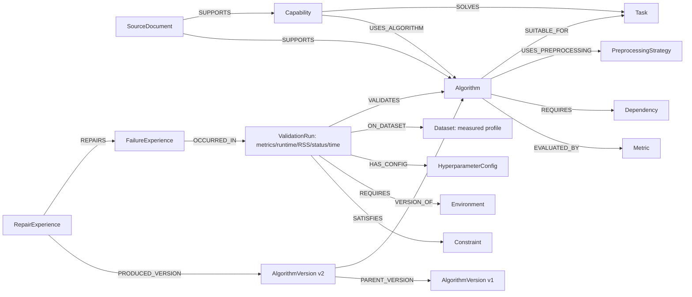
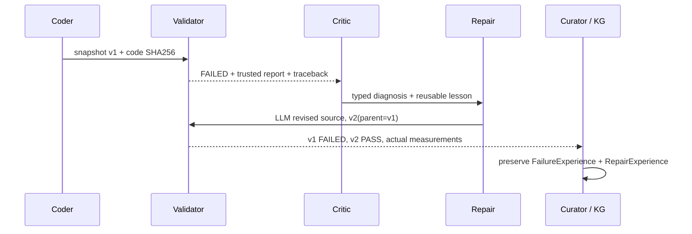
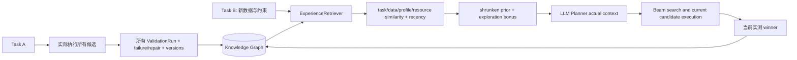

# AI Algorithm Factory 系统架构

系统采用分层模块与同步 Agent 工作流。基线审计见 [TECHNICAL_AUDIT.md](TECHNICAL_AUDIT.md)，实测验收见 [FINAL_ACCEPTANCE.md](FINAL_ACCEPTANCE.md)。

公开文本的补充验收通过 `scripts/run_text_acceptance.py` 在下面的开发工作流之后追加独立测试：冻结开发阶段 winner/源码/数据 hash → 全部开发集重新训练 → 仅评估最终测试集 → 保存独立报告。最终结果不进入规划/修复循环；API 按原报告 hash 附加显示，开发指标不被覆盖。具体协议见 [TEXT_ACCEPTANCE.md](TEXT_ACCEPTANCE.md)。

## 端到端工作流

## 实际职责和权限

协调器采用同步、顺序执行的 specialist workflow。各 LLM 角色具有独立 system prompt、结构化输入和输出校验，共享模型服务，通过显式消息契约交换上下文。确定性角色直接执行检索、验证和持久化操作。系统运行于单进程协调模式。

| 角色 | 输入 | 输出及校验 | 协调器允许的工具 |
|---|---|---|---|
| RequirementAgent | 用户文本、CSV 可测字段 | RequirementContract → CapabilitySpec；指标与任务兼容、字段存在、阈值 | understand |
| KnowledgeExtractionAgent | source chunks、AST 事实、实验内容 | KnowledgeExtractionContract；实体/边引用、原文跨度、来源 hash | ingest |
| RetrievalAgent | CapabilitySpec + KG | KnowledgeContext；路径、融合分数、历史案例 | retrieve |
| PlannerAgent | 独立 evidence channels | PlannerAdviceContract；合法算法、依据 ID、参数白名单；AlgorithmPlan | advise / plan / search |
| CoderAgent | requirement + plan + knowledge + protocol | 完整 Python；共享静态/接口 gate；失败输出保留 | generate |
| ValidatorAgent | 不可变代码版本、数据、配置 | ValidationResult；父进程计算指标 | validate |
| CriticAgent | 原代码、可信报告、历史失败 | DiagnosisContract；观测错误类别由验证器确定 | critique |
| RepairAgent | 原代码、诊断、traceback、阈值差距、经验 | RepairContract；diagnosis / strategy / revised_code + 同一 gate | repair |
| CuratorAgent | 全部候选、所有 attempts | ValidationRun、Version、Failure、Repair 的 ID | curate |
| ExplanationAgent | 实测候选及检索依据 | ExplanationContract；数值与引用逐项核对 | explain |

权限由 `AgentRuntime.call` 强制检查并记录有序事件，未授权工具调用在执行前失败。它约束协调器分派，并非 Python 对象能力安全系统。错误保留为失败报告；模型重试有界，真实模式默认禁止静默模板获胜。

## 知识图谱

详细关系约束和来源规则见 [knowledge_graph_schema.md](knowledge_graph_schema.md)。GraphML 是导出格式，检索在 NetworkX 图对象上执行。

## 修复与版本链

修复上限默认 3 轮；没有源代码变化或没有通过修复 gate 时结束，并明确失败。专门演示通过显式参数故意把 predict 改名，真实 Critic/Repair 负责修复；故障注入不用于普通任务。

## 经验学习闭环

历史指标按相似度和时间加权，并通过有效样本量收缩到中性 prior。冷启动人工 seed 权重较弱。搜索保留算法多样性和未充分验证候选；最终只按当前通过验证的候选实测指标选优。单次高历史分不会锁死算法选择。

## 模块边界与运行限制

`workflow.py` 只编排；候选/版本循环在 `execution/candidates.py`。LLM transport、安全处理、schema、graph retrieval、semantic retrieval、experience、search、trusted evaluation 和 worker 各有独立模块。API 写操作单进程加锁，适合本地单用户；没有多租户鉴权或分布式数据库事务。生产部署应增加鉴权、作业队列、数据库事务和专用容器/VM 执行服务。

